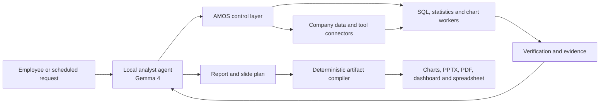

# AMOS: An Internally Deployed Analyst System

> AMOS is an internally deployed analyst system that connects to company data
> and tools, answers business questions, performs verified analysis, and
> produces graphs, reports, and presentation slides.

AMOS includes a local analyst agent, a control layer, data and tool connectors,
deterministic analytical workers, verification, evidence, review, and artifact
generation. The model proposes analytical work and explanations. AMOS decides
what is permitted, runs authoritative calculations outside the model, checks
the resulting claims, and produces decision-ready artifacts.

The long-term product goal is to automate the end-to-end work now performed by
data analysts and business analysts. The first releases prove that goal one
recurring workflow at a time and retain review where the evidence or impact 
requires human judgment.

## Product flow



The complete target product is defined in
[the product requirements](docs/PRODUCT_REQUIREMENTS.md). The current Rust
implementation proves the control-layer foundation with one configured tenant,
one read-only SQLite connector, deterministic statistics and charting,
governed documents, typed report claims, review, invalidation, replay, and
local publication. All workflow behavior is loaded from a versioned,
schema-validated analysis packs (see `demo/*/pack.json`); the
subscription-churn pack is the default bootstrap configuration, not a hardcoded
workflow.

- [Research paper](papers/AMOS_research_paper.pdf): the memory-operating abstraction, core primitives, reference scenario, and evaluation.
- [Design proposal](papers/AMOS_design_proposal.pdf): the product architecture and normative Specifications A–F.
- [Product requirements](docs/PRODUCT_REQUIREMENTS.md): the canonical product
  outcome, Gemma 4 integration, artifact outputs, and release requirements.
- [Rust requirements matrix](docs/RUST_REQUIREMENTS_MATRIX.md): direct traceability from both papers to implementation modules.

## What the current control-layer implementation provides

- **Governed memory:** typed, versioned objects with authority, effective time, permissions, supersession, provenance, and immutable source-version identity.
- **Permission-first context:** indexed tenant/type/status/time/label filtering happens before bounded top-K ranking; consistency minima, exact lexical token accounting, role coverage, ambiguity, omissions, and a ranking trace are frozen in the context manifest.
- **A-TXN runtime:** atomic idempotent admission, explicit compare-and-swap transitions, same-commit outbox records, fence-checked execution commits, atomic evidence commits, leased jobs, and durable audit events. A state-driven controller resumes every automatic lifecycle boundary after process loss.
- **Safe execution:** a frozen parsed SQL subset, schema and metric checks, blocked-column enforcement, bounded declared repairs, constant-time verified short-lived capabilities with full invocation binding, driver cancellation, and incremental row/byte/time limits.
- **Evidence and review:** typed claims, dependency edges, queryable independent validity dimensions, idempotent human approval/rejection/correction, atomic append-only feedback commits, and reviewer-approved local publication.
- **Continuous validity:** quota-bounded transitive invalidation, durable continuation/revalidation workers, dimension-specific outbox events, durable connector event cursors, and level-3 replay with new fenced executions, comparison evidence, audit, and outbox state.
- **Operations and privacy:** a checksummed forward-only migration ledger, leased outbox dispatch with retry/dead-letter behavior, tenant-safe metrics, request/correlation IDs, security headers, legal holds, due erasure with claim revocation, and audit proof.
- **Publication:** hash-addressed filesystem staging and atomic promotion are idempotent across lost acknowledgments; destination-specific cloud adapters remain deployment integrations.
- **Product surfaces:** a server-rendered Analysis Workspace, Memory Studio, Review Queue, and Operations Console—without a JavaScript runtime.

The application, CLI, API, UI rendering, persistence, connectors, workers, and tests are all written in Rust. SQLite supplies reproducible local warehouse and control-plane adapters; the domain contracts remain independent of SQLite, Axum, or any model SDK.

## How it started

While studying data analytics at Carnegie Mellon, I worked on a PNC-sponsored Next Best Action project, built the Ashe system, and completed several other analytics projects. Although their outputs differed, the same work kept repeating: translating a business question into the right data and definitions, cleaning and reconciling the data, choosing and running the right analysis, verifying the results, and presenting them in a form decision-makers could use.

I realized that the most valuable part was not any individual application. It was the workflow for choosing and coordinating the right tools behind all of them.

Existing AI tools could help with isolated steps such as writing SQL or Python, but I could not find a system I would trust to perform the complete analyst workflow inside a company. For organizations with sensitive data, an AI analyst must operate within their environment, understand their business definitions, follow existing permissions, perform calculations with reliable tools, and connect every conclusion to supporting evidence. The model can propose the work, but it should not control access or become the source of truth.

After graduating, I began building AMOS and asked Perry, a close friend since high school, to join me. David and Divvy later joined the team. Perry and Divvy are experts in system design and David is an expert in agentic AI and data connectivity. All four founders are technical and write code; we have built the core product ourselves without contractors. As we expand and start working with enterprise customers, we have also begun forming an advisory board. Our first advisor is Matthew, a close friend of Perry since middle school, who works as a trader at Jump Trading. He has been helping us think through the financial services market and introducing us to people in the enterprise and fintech ecosystem.

In our first month, we built a working Rust prototype that controls data access, executes and verifies analyses, preserves supporting evidence, and produces reviewable results. We also interviewed nine data leaders, analysts, and technical experts. CMU faculty helped us refine the technical approach, while industry practitioners helped us test the customer need.

These experiences led to our core insight: better models alone will not unlock AI analysts inside enterprises. Models are becoming capable of proposing SQL, analyses, and explanations. The remaining bottleneck is trust—controlling what the AI can access, verifying its work outside the model, and tracing every conclusion back to evidence. AMOS provides that operating layer.

## Quick start

Install the stable Rust toolchain, configure the approved model boundary, then
run the subscription-churn vertical slice:

```bash
cp .env.example .env
# Set GEMINI_API_KEY in .env. Never commit it.
set -a; source .env; set +a

cargo run --release --locked -- \
  --demo --root .demo-recording \
  serve --seed-demo --bind 127.0.0.1 --port 8000
```

The bundled binary is fail-closed unless `--demo` (or `AMOS_DEMO=true`) is
explicitly set. The demo uses a named demo signing key and static local
identities; embedding applications must construct `RuntimeConfig::new` with
their own capability secret and pass an `IdentityProvider` to `api::router`.
There is no deterministic production planner: a missing, unavailable, or
invalid model fails before plan execution and publication.

Every API and UI route except `/health` and `/v1/openapi.json` requires an explicit bearer identity.
For example:

```bash
curl -H 'Authorization: Bearer analyst_001' http://127.0.0.1:8000/
curl -H 'Authorization: Bearer analyst_001' http://127.0.0.1:8000/v1/memory
```

The authenticated product surfaces are:

- `/` — Analysis Workspace
- `/memory` — Memory Studio
- `/reviews` — Review Queue
- `/operations` — Operations Console

The explicit local demo also includes a scripted retail-banking advisor concept:

```bash
cargo run -- --demo --root .demo-advisor serve --seed-demo --bind 127.0.0.1 --port 8000
```

Open `http://127.0.0.1:8000/demo/login`, continue as Advisor, and select
`Open Advisor Workspace`. The prefilled question is:

> Tell me about this client and what should I sell to him

Submitting it renders a synthetic client briefing with a relationship timeline,
peer-product adoption chart, available-balance chart, next-best conversation,
alternative product, talking points, suitability guardrails, and evidence
placeholders. This surface is intentionally labeled as a scripted future-product
preview: it does not call Gemma, query live banking data, or perform a sale or
enrollment. The governed subscription workflow remains the executable product
slice.

For an interactive browser walkthrough, open `http://127.0.0.1:8000/` and use
the visible `Local demo identity` switch. It maps only the fixed Analyst,
Reviewer, and Administrator demo identities through a random server-side
session in an `HttpOnly`, `SameSite=Strict` cookie. Demo session and governed
source-successor routes are absent from `api::router`, the production router.

The explicit demo mode accepts local bearer identities `analyst_001`,
`analyst_002`, `reviewer_001`, and `admin`. They exist only for local
development and must be replaced by an enterprise identity provider in an
embedding deployment. Missing, malformed, and unknown credentials return
`401 UNAUTHENTICATED`; authenticated identities that lack authority return
`403 PERMISSION_DENIED`.

Run the subscription question from the CLI:

```bash
cargo run -- --demo run \
  --idempotency-key subscription-churn-001 \
  --request "Why did SMB logo churn increase this week, and should the executive dashboard attribute it to the pricing email?"
```

The run calls the configured Gemma provider for planning and narrative,
executes three admitted read-only SQL steps outside the model, and returns a
context manifest, typed plan, verified executions, safe HTML report, claims,
dependencies, replay package, and explicit `needs_review` outcome. Replay the
resulting artifact with:

```bash
cargo run -- --demo replay ARTIFACT_ID --idempotency-key replay-001
```

Use a separate data root or port when needed:

```bash
cargo run -- --demo --root /tmp/amos-demo serve --port 8080 --seed-demo
```

The full release and 90-second recording procedure is in
[the demo runbook](docs/DEMO_RUNBOOK.md). A live compatibility probe and full
HTTP smoke/rehearsal are:

```bash
scripts/live-model-smoke.sh
scripts/demo-smoke.sh
scripts/rehearse-recording.sh
```

Set `AMOS_PROBE_ROOT=.demo-recording` when the compatibility result should
remain visible from that recording server's `/health` response.

## HTTP contract

The versioned `/v1` API has a 1 MiB request limit, explicit mutation keys, stable error envelopes, request/correlation headers, and fail-closed authentication. It covers:

- task admission and lifecycle inspection;
- permission-first memory search, writes, and supersession;
- structured SQL preflight and referenced-version reporting;
- artifact, claim, evidence, and audit inspection;
- reviewer approval, rejection, correction, and governed feedback;
- replay and artifact dependency revalidation;
- connector health, durable jobs, source-event processing, operations metrics, retention, legal hold, and erasure.

Representative endpoints include `POST /v1/tasks`, `GET /v1/tasks/{id}`, `GET /v1/artifacts/page`, `POST /v1/memory/search`, `POST /v1/verify/sql`, `GET /v1/artifacts/{id}`, `GET /v1/claims/{id}`, `POST /v1/reviews`, `POST /v1/replay/{id}`, `POST /v1/retention`, and `POST /v1/retention/memory/{id}/erase`. The machine-readable contract is at `/v1/openapi.json`.

Task, replay, review, job, retention, and erasure mutations require an
`idempotency_key`. Repeating the same command returns the original effect and
creates no duplicate durable side effects; reusing a key for different
content returns `409 IDEMPOTENCY_CONFLICT`.

## Verification

```bash
cargo fmt --all -- --check
cargo clippy --all-targets --all-features -- -D warnings
cargo test --all-targets
cargo test --all-targets --release
cargo build --release
cargo doc --no-deps
AMOS_BENCH_MEMORY_ITEMS=10000 cargo bench --bench control_paths
```

The Rust regression suite additionally exercises crash-at-every-checkpoint recovery, stale fences and policy epochs, migration tampering, cancellation/timeouts, incremental byte limits, outbox retry/dead-letter recovery, durable connector cursors, object-promotion lost acknowledgments, legal hold/erasure, opaque cursor pagination, request limits, and browser security headers.

The capacity executable reports and gates p50/p95/p99 for indexed retrieval,
SQL preflight, durable commits, job lease/complete, claim invalidation, a full
governed task, and persisted computational replay. Set
`AMOS_BENCH_CONTROL_ITERATIONS` to increase the default control-path sample
count.

## Architecture

- `src/domain.rs` — paper-defined objects, outcomes, validity dimensions, and A-TXN states.
- `src/store.rs` — tenant-scoped SQLite persistence, CAS transitions, atomic evidence/review/publication/validity commits, outbox, audit, and jobs.
- `src/memory.rs`, `src/context.rs`, `src/policy.rs` — governed memory, reconciliation, compaction, and permission-first context compilation.
- `src/connectors.rs`, `src/workers.rs` — typed connector interface and capability-bound SQL, statistics, and chart workers.
- `src/verification.rs` — SQL, schema, metric, freshness, repair, and claim-support verification.
- `src/evidence.rs`, `src/scheduler.rs` — citations, review feedback, invalidation, and fenced background work.
- `src/publication.rs`, `src/observability.rs` — hash-checked local object promotion and tenant-safe operational metrics.
- `src/runtime.rs` — complete A-TXN vertical slice, publication, revalidation, and replay orchestration.
- `src/api.rs`, `src/main.rs` — Axum HTTP/UI surfaces and the command-line application.
- `tests/` — Rust unit, API, security, and end-to-end contracts.

## Current implementation boundary

The target product includes a customer-local analyst agent and deterministic
generation of graphs, reports, slides, dashboards, and spreadsheets. Those
features are required by `docs/PRODUCT_REQUIREMENTS.md` but are not yet present
in the current Rust slice. General Python execution, arbitrary production
writes, unrestricted notebook code, general multi-agent scheduling, unreviewed
causal claims, and autonomous external communication remain outside the first
release.

The local implementation supplies complete contracts and executable adapters for SQLite, filesystem object promotion, static demo identity, and local dispatch. The following release integrations genuinely require deployment infrastructure or credentials and are not represented as completed here: PostgreSQL forced RLS and backup/restore, enterprise OIDC/SAML validation, KMS/HSM-backed signing-key rotation, S3/GCS regional lifecycle controls, customer warehouse credentials, container/VM worker sandboxing and egress policy, and external publication destinations. Their conformance targets are the same tenant, capability, fence, hash, idempotency, acknowledgment, and audit contracts tested by the local adapters.

Frozen paper artifacts, evaluation JSON, and scenario fixtures remain in the repository as research evidence; no legacy Python or JavaScript application code remains.
