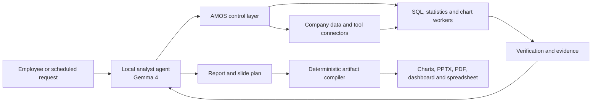

# AMOS Company, Product, Investor, and YC FAQ

Last product-direction update: 2026-07-25

## Canonical product definition

> AMOS is an internally deployed analyst system that connects to company data
> and tools, answers business questions, performs verified analysis, and
> produces graphs, reports, and presentation slides.

The customer buys AMOS as a complete analyst system. The customer does not need
to provide a separate AI agent. AMOS includes a local analyst agent, beginning
with support for Gemma 4, while keeping the model behind AMOS permissions,
verification, execution, evidence, and review.

The model understands the request, proposes the plan, drafts tool calls,
interprets verified results, and plans the report and slides. AMOS controls
access, executes authoritative calculations, checks every material claim, and
renders the final artifacts. Subscription-churn analysis is not the product.
It is the reference analysis pack: all workflow behavior loads from a
versioned, schema-validated pack configuration rather than hardcoded logic.

Every business answer falls into one of three categories:

- **Verified now:** supported by the repository, executable tests, public
  records, or a cited source.
- **Working hypothesis:** a proposed strategy or price that still needs
  customer evidence.
- **Founder input required:** the repository does not contain the personal,
  legal, financial, or customer fact needed to answer honestly.

YC's own guidance is simple: answer the question in the first sentence, use
specific facts, avoid marketing language, and disclose important obstacles.
The short answers below follow that rule. The longer explanations are for
follow-up questions.

## The shortest honest description

### What does AMOS do?

**Answer:** AMOS connects to a company's data and tools, uses a locally deployed
analyst agent to answer business questions, verifies the analysis, and produces
graphs, reports, and presentation slides.

In one line:

> AMOS performs the analyst workflow while keeping data access, calculations,
> claims, and outputs controlled and reproducible.

### What is the current product?

**Verified now:** The repository contains the control-layer foundation as a
local Rust application. It includes permission-aware context, SQL and metric
checks, bounded execution, deterministic statistics and charting, claim-level
evidence, human review, invalidation, replay, an HTTP API, a CLI, and four
server-rendered product pages.

The executable slice is pack-driven but ships one reference pack. It does not
yet include the Gemma 4 analyst agent, a general report and slide planner, PPTX/PDF/spreadsheet
generation, production customer connectors, enterprise login, hardened remote
workers, or a supported customer deployment package. Those are required
product work, not completed features.

### What problem does AMOS solve?

An AI-generated analysis can be wrong even when its SQL runs. It may use an old
metric definition, a stale schema, incomplete data, information the user may
not see, or an unsupported causal explanation. When any of those inputs later
change, a previously published conclusion can also become unreliable.

AMOS combines an analyst agent with explicit checks and records between the
model and company systems. The goal is to complete the analytical deliverable,
not merely flag risk. The output must still be controlled, inspectable,
reviewable, and change-aware.

### Who is the first customer?

**Working hypothesis:** A company with at least 500 employees that has a data
warehouse, recurring analyst queues, and business teams waiting for reports or
presentations. The first useful workflow is a recurring business review whose
inputs and expected output can be compared with the company's existing analyst
process.

The likely buyer is a VP of Data, Head of Analytics, Head of AI Platform, or
Chief Data Officer. A staff data engineer, analytics engineer, or AI-platform
engineer is the likely technical champion. Security, governance, and compliance
teams are approval stakeholders, not necessarily the daily user.

No customer interviews, design partners, paid pilots, or purchase commitments
are documented in this repository. The target customer is therefore a
hypothesis, not a validated segment.

### Why now?

AI use inside companies is growing, but agent deployment is still early. The
U.S. Census Bureau reported that 37% of firms with at least 250 employees used
AI in business operations in May 2026, while its detailed study found
especially high use in large information, professional-services, and finance
firms. Stanford's 2026 AI Index reported broad organizational AI use but
single-digit agent deployment across most business functions. This creates a
short window in which companies are choosing how agents will access data and
how their work will be reviewed.

The need is also becoming explicit in standards and regulation. NIST launched
an AI Agent Standards Initiative in 2026 and highlighted identity,
authorization, auditing, least privilege, and prompt-injection containment.
Most provisions of the EU AI Act begin to apply on 2026-08-02, with different
dates for some high-risk provisions. ISO/IEC 42001 defines an AI management
system centered on risk, traceability, transparency, and continual
improvement.

These trends support the problem. They do not prove that customers will buy
AMOS rather than use an existing platform or internal code.

### What is the immediate company goal?

**Working hypothesis:** Secure three paid design partners for one narrow,
recurring analytical workflow. Run AMOS in shadow mode beside the existing
analyst process for four weekly cycles. Measure review time, unsupported claims,
metric or permission errors, replay success, onboarding time, and whether the
customer will renew or expand.

That customer evidence matters more now than adding another broad feature.

## Product and user questions

### Is AMOS an operating system?

Not like Linux, Windows, or macOS. "Operating layer" describes its role between
the included analyst agent and company data and tools. The customer-facing
description is "internally deployed analyst system," because customers buy the
completed analytical outcome rather than a runtime component.

### Is AMOS an AI model or chatbot?

AMOS is a complete analyst product that includes a model, but it is not only a
model or chatbot. Gemma 4 is the first planned local model family. The durable
product value is the full system: connectors, permitted context, analytical
planning, bounded tools, verification, evidence, review, and artifact
generation. Customers may substitute another approved model without replacing
the rest of AMOS.

### What does a user actually do?

In the target product:

1. An employee asks a business question or schedules a recurring analysis.
2. The local analyst agent identifies the necessary metrics, sources, and
   analytical steps.
3. AMOS supplies only permitted context and verifies the typed plan.
4. Capability-limited workers run approved SQL, statistics, and charting.
5. The agent interprets the verified results and proposes a report and slide
   plan.
6. AMOS verifies each material claim and deterministically renders graphs,
   PPTX, PDF, dashboard, and spreadsheet outputs.
7. A reviewer resolves any high-impact, causal, regulated, or unsupported item.
8. AMOS publishes the approved package and later revalidates it when sources
   change.

The current page implements only a fixed reference fixture. It must become this
domain-neutral user experience.

### What is the first commercial use case?

**Working hypothesis:** A recurring executive business review that currently
requires an analyst to collect data, calculate changes, explain supported
drivers, create graphs, and prepare slides.

The exact department should follow the first design partner's demand. A useful
first workflow has approved metrics, read-only sources, a repeatable output,
visible analyst time, and a reviewer who can judge correctness. The product
must not be branded around the department or dataset chosen for that pilot.

### What is the user's current alternative?

The normal alternative is a mix of:

- an analyst or data engineer writing SQL;
- a semantic layer or approved metric definition;
- a catalog and lineage tool;
- a notebook or BI dashboard;
- a ticket or chat thread for review;
- an agent trace or application log;
- manual investigation when a source changes.

A company can assemble these pieces itself. AMOS is useful only if joining them
into one enforced workflow saves enough review and engineering time or reduces
enough risk to justify another system.

### Why not let the AI query the warehouse directly?

Direct access is easier, but it can expose excessive permissions, credentials,
sensitive columns, expensive queries, and destructive operations. It also
makes it harder to prove which metric, schema, data state, and policy supported
a written conclusion.

AMOS is a second control layer. The warehouse must still enforce its own
identity, row, column, network, and query controls.

### Does AMOS replace a data warehouse?

No. Raw data remains in the warehouse or other system of record. AMOS stores
governed metadata, references, execution records, claims, review decisions,
and evidence.

### Does AMOS replace BI?

Not necessarily. AMOS produces its own graphs, reports, slides, dashboards, and
spreadsheets, while existing BI tools may remain publication destinations or
sources of approved metric definitions. A customer may use AMOS without
building the final deliverable manually in BI.

### Does AMOS replace a catalog, semantic layer, or lineage tool?

No. Those systems should supply schemas, metrics, classifications, ownership,
and data lineage. AMOS's proposed role is to apply that information to each
agent task, verify execution, and connect the resulting written claims to the
exact state and computation used.

### Does AMOS perform the analysis?

Yes. The included analyst agent plans and interprets the work. Tool workers
perform authoritative SQL, statistics, and chart computation. AMOS verifies
the plan, results, and written claims, then generates the final deliverables.
The model does not become the source of truth for calculations.

### Is the goal to replace data analysts and business analysts?

Yes, for supported workflows. The long-term product goal is to complete the
end-to-end work: understand the business question, obtain the permitted data,
perform the analysis, explain the result, produce the graphs and presentation,
answer follow-up questions, and keep recurring work current.

That is not a current product claim. The present repository proves only part of
the control and execution layer. AMOS should claim replacement only after
customer evidence shows that a workflow is completed at the required accuracy,
coverage, review burden, reliability, and cost. Early releases retain review
for high-impact, causal, regulated, or insufficiently supported conclusions.

### Who chooses the tool?

The agent or application can propose a sequence. AMOS independently checks
whether the user, source, relation, operation, parameters, and resource limits
are allowed before a worker runs it.

### Can one analysis use several tools?

Yes. A task may use read-only SQL, deterministic statistics, charting, document
retrieval, and approved business-tool connectors. Each step has its own
authorization, inputs, output hash, resource counts, and dependency records.

### Does AMOS support general exploratory analysis?

No. The current implementation supports a fixed metric family and constrained
query shapes. General exploration would need additional approved tools,
profiling and sampling rules, result limits, user controls, and verification.

### Does AMOS support PCA?

No. Principal Component Analysis is not implemented.

If added, a governed PCA tool should record the input data version, selected
columns, filters, sampling, missing-value treatment, scaling method, library
version, component count, seed where relevant, limits, outputs, and claims
derived from the result.

### Does AMOS support Python or notebooks?

No. Arbitrary Python and notebook execution are intentional non-goals for the
current slice because they add dependency, network, sandbox, reproducibility,
and data-exfiltration risks. A later product can add narrow, versioned
statistical tools before considering unrestricted code.

### Can AMOS write to a production database?

No. The current connector is read-only. Production writes would need explicit
approval policy, transaction and rollback rules, destination-specific
permissions, idempotency, and stronger isolation.

### Can AMOS publish externally?

The current application supports local, hash-addressed filesystem publication
after review. It does not publish to Slack, email, BI, S3, GCS, or another
external destination.

### Can customers choose the model?

Yes in the product design. AMOS will ship with local Gemma 4 support and a
provider-neutral model contract. A customer can select the supported Gemma
profile, another approved self-hosted model, a private endpoint, or an allowed
hosted provider without changing AMOS's permissions, workers, evidence, or
artifact contracts. This model integration is not yet implemented.

### Why Gemma 4?

Gemma 4 is suitable for the first local model integration because it supports
instruction following, structured tool use, system prompts, long context,
quantized local deployment, and commercial distribution under Apache 2.0. The
planned standard profile is Gemma 4 26B A4B Q4; 12B Q4 is the lower-resource
profile and E4B Q4 is for development or constrained tasks.

Gemma 4 is not trusted to enforce permissions or calculate authoritative
figures. It operates inside the AMOS contract and can be replaced if another
model performs better on the customer's evaluated tasks.

### Does a self-hosted model remove the need for AMOS?

No. A self-hosted model can still use the wrong metric, query a prohibited
column, rely on stale data, or make an unsupported conclusion. Hosting answers
where model computation occurs. AMOS addresses task authorization, analytical
state, execution evidence, review, and later invalidation.

### What does "memory" mean?

Memory is governed organizational state needed for analysis: schemas, metrics,
policies, source versions, approved documents, prior work, and reviewed
corrections. Each item has a type, version, authority, effective time,
permissions, status, provenance, and supersession history.

It is not an unrestricted chat transcript, and it is not just a vector
database.

### Why filter permissions before ranking context?

If unauthorized items enter retrieval before filtering, their contents or even
their existence can influence ranking and model context. AMOS applies tenant,
identity, status, time, type, and label filters before it ranks candidates. It
checks permission again before execution and publication.

### Does AMOS learn from every interaction?

No. User notes are non-governing. Reviewer feedback is append-only, attributed,
versioned, and scoped. A model output does not silently become an authoritative
metric, policy, or fact.

### What is a claim?

A claim is a material statement in a result, such as "payment failures rose
from 2.2% to 7.4%." AMOS can link that statement to the query, result hash,
data version, metric, schema, verification, review decision, and supporting
claims.

### What does evidence-backed mean?

It means the conclusion is not stored only as prose. The product preserves the
records needed to inspect how it was produced. Evidence can prove execution and
declared support; it cannot by itself prove that a method or interpretation was
the best one.

### What is replay?

Replay creates a new analytical transaction from durable execution metadata,
runs it again, and stores an exact, equivalent, or different comparison. It
does not overwrite the original result.

### What is invalidation?

When a source, metric, schema, policy, or upstream result changes, AMOS follows
recorded dependencies and updates the affected validity dimensions. It can say
that a claim's computation, policy, source, or publication validity needs
review without deleting the historical claim.

### Does AMOS guarantee that a conclusion is true?

No. It can check permissions, supported SQL structure, schema and metric use,
resource limits, execution records, numeric support, and declared
dependencies. It cannot automatically decide whether every analytical method
or business interpretation is correct. Important causal and high-impact
conclusions still require qualified review.

## Current progress, traction, and proof

### How far along is the product?

**Verified now:** The public repository was created on 2026-07-12. By
2026-07-22 it contained version `0.2.0`, a complete local control-layer
reference workflow, API, CLI, four product pages, papers, evaluation artifacts,
and a release-gated Rust test suite.

The current code proves a local contract. It does not prove that a customer can
deploy AMOS safely in a real enterprise environment or that the complete
Gemma-powered analyst product can perform general analyst work.

### What is working today?

The local product includes:

- one configured tenant;
- static local demo identities;
- one read-only SQLite warehouse connector;
- one installed analysis pack (subscription churn);
- typed, versioned, permission-aware memory;
- bounded context with exact token accounting;
- parsed read-only SQL checks;
- schema, metric, freshness, and policy verification;
- signed, narrowly scoped worker capabilities;
- deterministic SQL, statistics, and chart workers;
- claims, evidence, review, correction, and local publication;
- transitive invalidation and durable replay;
- crash recovery, leased jobs, an outbox, audit, retention, and erasure;
- an Axum HTTP API, CLI, and server-rendered pages.

### What is not working as a production service?

The repository does not include:

- enterprise OIDC or SAML;
- PostgreSQL row-level security, backup, and point-in-time recovery;
- customer warehouse credentials or certified Snowflake, Databricks, BigQuery,
  Redshift, or PostgreSQL connectors;
- KMS- or HSM-backed key custody and rotation;
- hardened container or VM workers with enforced egress policy;
- managed queues, object storage, observability, alerting, or on-call;
- regional deployment and data-residency controls;
- external publication adapters;
- the Gemma 4 analyst agent or provider-neutral model router;
- general report planning and deterministic PPTX, PDF, dashboard, and
  spreadsheet generation;
- configurable domain packs and a production connector kit;
- a production SLA, support process, penetration test, SOC 2 report, or ISO
  certification.

### Are people using it?

**Founder input required.** There is no repository evidence of external active
users, customer accounts, design partners, pilots, or production usage. Do not
count the local demo, test executions, paper evaluation, repository views, or
GitHub stars as customer usage.

### Does AMOS have paying customers?

**Founder input required.** No contracts, invoices, or customer records are in
the repository. Unless the founder can provide separate evidence, the honest
answer is "No."

### Does AMOS have revenue?

**Founder input required.** No revenue is documented. Unless the founder has
separate records, the honest answer is `$0 revenue` and `$0 MRR`.

### Does AMOS have a sales pipeline, LOIs, or design partners?

**Founder input required.** None are documented. A target list is not a
pipeline, a conversation is not an LOI, and an LOI is not revenue. Track each
named account, buyer, problem, stage, next action, expected value, and decision
date.

### What is user or revenue growth?

There is no verified user or revenue base from which to calculate growth.
Product development speed is not customer growth.

### What retention or engagement metrics exist?

None for real users. The product should later track weekly governed runs,
review completion, repeated workflows, reviewer time, replay frequency,
invalidations resolved, active teams, renewal, and expansion.

### What evidence shows that people want this?

Current evidence shows that the technical problem exists:

- official statistics show growing enterprise AI use;
- NIST is working on agent identity, authorization, and audit standards;
- regulation and management standards require more AI accountability;
- large vendors and funded startups are building adjacent products.

That is market context, not demand for AMOS. The missing evidence is direct:
interviews, observed workflows, paid pilots, renewal, and expansion.

### What do the benchmark results prove?

The frozen evaluation shows that AMOS produced the expected governed outcome on
12 of 12 controlled invariant tasks, while the strongest local component
baseline matched 6 of 12. It also passed seeded variants in payment,
subscription, and warehouse-quality evaluation domains and exercised indexed
state up to one million memory objects and one million provenance edges.

These are controlled, mostly synthetic, developer-run experiments. They do not
prove customer ROI, general accuracy, production security, production capacity,
or superiority over current commercial platforms.

### Has the evaluation been independently reproduced?

Not yet. The repository contains a preregistered external protocol and intake
templates, but no returned independent study results. The FAQ must not describe
the planned study as completed validation.

### What does the current performance evidence show?

On the documented local release benchmark with 10,000 memory objects, retrieval
p95 was 42.567 ms, the governed task p95 was 30.148 ms, and replay p95 was
26.145 ms. Every configured local threshold passed.

Those values apply only to that machine, build, fixture, and workload. They are
not throughput, memory, concurrency, or noisy-neighbor claims for a hosted
service.

### What progress is most impressive?

The verifiable fact is execution speed: a public repository created on
2026-07-12 reached a broad, tested local Rust implementation by 2026-07-22.
What is not known is how much design work predated the repository, how much
founder time was full-time, and what proportion of implementation was produced
or reviewed by each contributor.

### What should the next proof point be?

One customer should run one recurring report through AMOS in shadow mode for
four weeks. A useful result would show:

- every numeric claim resolves to evidence;
- no confirmed critical permission leak;
- the same report can be replayed;
- a seeded source or metric change reaches all dependent claims;
- reviewer time falls materially from the customer's baseline;
- onboarding takes fewer than ten business days;
- the customer pays and wants a second workflow.

## Market and timing

### How large is the market?

**Working hypothesis:** Use a bottom-up account calculation, not a percentage
of a broad "AI market."

Public account counts provide a reasonable ceiling:

- The 2022 U.S. Census SUSB table reports 21,041 U.S. firms with at least
  500 employees.
- Of those, 11,306 are in information, finance and insurance, professional and
  technical services, or health care and social assistance.
- Eurostat reports 55,000 EU enterprises with at least 250 employees and
  251,000 with 50 to 249 employees in 2024.

Most of those organizations will not buy AMOS. The product also has no verified
price. A transparent scenario is more honest than a single TAM number:

| Scenario | Potential accounts | Assumed annual contract | Annual market |
|---|---:|---:|---:|
| Narrow initial segment | 2,000 | $75,000 | $150 million |
| Broader governed-analysis segment | 10,000 | $125,000 | $1.25 billion |
| Long-term cross-platform segment | 25,000 | $150,000 | $3.75 billion |

These are multiplication scenarios, not forecasts. The account counts and
prices use different definitions and have not been validated together. The
next market-sizing work is to test willingness to pay with 30 qualified buyers
and three paid pilots.

### What is the initial serviceable market?

**Working hypothesis:** Large U.S. information, finance, professional-services,
software, retail, logistics, and health organizations that already have:

- a cloud warehouse or governed analytics stack;
- an internal data or AI platform team;
- a sensitive, recurring analytical report;
- a reviewer or approval requirement;
- a plan to let an AI create or update that report.

The first sales list should be tens of named accounts, not thousands of
anonymous companies.

### What is a credible obtainable market?

Before product-market fit, the meaningful target is not a giant SOM slide. It
is:

- 3 paid design partners;
- 10 production customers;
- then 20 customers at an observed annual contract value.

At a hypothetical `$100,000` annual contract, 20 customers would be `$2 million
ARR`. Neither the customer count nor price is achieved today.

### Is this venture-scale?

Potentially. A runtime used for many governed analytical workflows across data
platforms could support large enterprise contracts and expansion. The same
core could later serve several applications and agent frameworks.

The venture case fails if AMOS remains a custom integration for one report, if
platform vendors make the workflow native, or if customers will not add a
cross-platform runtime. Venture scale is therefore a product and distribution
hypothesis, not a property of the repository.

### Why has this not already been solved?

Parts have been solved:

- warehouses enforce data access;
- semantic layers define metrics;
- catalogs hold metadata and lineage;
- agent tools trace execution;
- review products capture feedback;
- governance platforms enforce policies.

The unsolved claim is that customers need one transaction joining permitted
context, verified analytical execution, written claims, human decisions,
replay, and later invalidation across those systems. AMOS must prove that
joining these parts creates enough value to buy.

### What market change could make AMOS unnecessary?

Snowflake, Databricks, Microsoft, Atlan, or another platform could make
claim-level verified analytical transactions a built-in feature. Customers
could also standardize on one data and AI stack and reject another control
layer. AMOS should therefore integrate with existing systems and win on
cross-platform workflow evidence, not assume they are incomplete forever.

## Business model and pricing

### How will AMOS make money?

**Working hypothesis:** Paid enterprise pilots followed by an annual software
subscription. Price should be based on governed workflows and environments,
not model tokens.

A simple starting structure to test:

- fixed-scope, 6- to 8-week paid pilot;
- annual base subscription for one environment and a limited number of
  governed workflows;
- higher tiers for additional environments, workflow packs, dedicated
  deployment, support, and compliance requirements.

Implementation work should be separately scoped and should not hide weak
software economics.

### What should the pilot cost?

**Working hypothesis:** Test `$25,000` to `$75,000` for a fixed-scope pilot that
includes one connector, one metric family, one report, one reviewer role, and
measured before-and-after results.

This range is not supported by signed deals. It is a price-discovery proposal.
Charge enough to test whether the problem has budget and urgency.

### What should an annual contract cost?

**Working hypothesis:** Test `$75,000` to `$250,000` per year after a successful
pilot, depending on deployment, environments, workflows, support, and security
requirements.

Do not put this range in a YC application as achieved pricing. Say it is the
current hypothesis and report every actual quote, objection, and signed amount.

### Why not price per token?

Model use is not the core customer value and may run through the customer's own
provider. Per-token pricing also rewards waste. The customer value is a
controlled workflow, review evidence, repeatability, and faster resolution
when data or definitions change.

### Why not price per user?

Seats may understate value because a small number of analysts and reviewers can
govern a high-value report used by many executives. A base platform fee plus
workflow or environment limits is more closely tied to operational scope.
This still needs price testing.

### What are the unit economics?

Unknown. There is no revenue, customer acquisition cost, hosting cost, support
cost, gross margin, retention, or payback data. Local benchmark latency cannot
stand in for unit economics.

### What customer ROI could justify the price?

**Working hypothesis:** Annual value can come from analyst and reviewer hours
saved, errors prevented before publication, faster audit evidence, and faster
identification of stale reports. A pilot should measure each against the
customer's current baseline.

Do not assign a dollar value to prevented incidents without the customer's own
frequency and loss data. A renewal decision is stronger evidence than a
spreadsheet built from generic breach costs.

### Is AMOS a product or a feature?

It is a product only if several workflows and applications can use the same
runtime, policies, evidence model, and operations without bespoke core changes.
Today it is a broad local reference product around one workflow. Two independent
customer applications using the same core would be an important product test.

### Could this become a consulting business?

Yes, and that is a major risk. Each enterprise has different identity,
warehouse, metric, policy, review, and publication systems.

The countermeasure is to keep the first pilot narrow, record every bespoke
step, and productize repeated work into connector certification, verifier
packs, task templates, and deployment automation. If the second customer still
requires core code changes, the product is not yet repeatable.

### Is AMOS open source?

The repository is public and `Cargo.toml` declares an MIT license, but the
repository currently has no root `LICENSE` file. That is not a complete
open-source licensing posture. Add the intended license file and confirm
ownership before describing AMOS as open source or accepting external
contributions.

### What is the long-term business model for a public codebase?

**Founder decision required.** Plausible options include:

- open-source runtime plus paid hosted operations and enterprise integrations;
- source-available core plus commercial enterprise features;
- commercial software with a public research reference implementation.

No choice is documented. Decide after customer conversations, not from fashion.

## Go-to-market and expansion

### How will AMOS get its first customers?

**Working hypothesis:** Founder-led outbound to 30 qualified data and AI
leaders, using a concrete workflow rather than a platform pitch.

Ask:

> Which recurring analysis would you let an AI draft today if every number had
> evidence, a reviewer stayed in control, and upstream changes could identify
> stale conclusions?

The first call is discovery. The second uses the customer's real workflow. The
third proposes a paid shadow pilot with a defined success scorecard.

### What is the ideal design partner?

A good first design partner:

- already has a warehouse, approved metrics, and a real review process;
- runs the same report at least weekly;
- can supply a read-only test environment;
- has a named data owner and reviewer;
- will share the current time and error baseline;
- can buy a pilot without a year-long procurement cycle;
- agrees to weekly product sessions and a decision date.

A company that only wants a broad AI strategy workshop is not a good first
partner.

### What exactly is sold in the first pilot?

One read-only connector, one metric family, up to three query shapes, one
chart, one report template, one reviewer role, replay, and source-change
invalidation. AMOS should shadow the existing deliverable before replacing it.

### How long should onboarding take?

The design proposal's paid-pilot gate is under ten business days. That target
is not yet demonstrated with a customer.

### What outcome should the customer buy?

Do not sell "trustworthy AI." Sell measurable changes:

- less analyst and reviewer time per recurring report;
- fewer metric, permission, and stale-data errors reaching review;
- faster audit or incident reconstruction;
- faster identification of reports affected by a changed source;
- a controlled path from AI draft to approved publication.

### What is the sales motion?

**Working hypothesis:** A technical, founder-led enterprise sale:

1. workflow and pain discovery;
2. data-flow and security review;
3. paid shadow pilot;
4. executive readout with measured results;
5. annual contract for the first production workflow;
6. expansion to additional metrics, reports, and teams.

### What are likely sales objections?

- "Our warehouse or catalog already does this."
- "We can build the missing glue."
- "Another layer increases latency and operational risk."
- "Your startup is too early for sensitive data."
- "You have no enterprise certifications."
- "The product supports only one workflow."
- "Human review removes the promised automation benefit."
- "We do not know who owns the budget."

The correct response is a narrow, measurable pilot and candid gap list, not a
general claim that AMOS is unique.

### What is the land-and-expand path?

Expand in this order:

1. complete one recurring report and slide deck for one team;
2. add more questions and metric families using the same connected sources;
3. automate more recurring reports for that team;
4. add another approved source in the same environment;
5. expand to another team or business unit;
6. add controlled higher-risk actions only after separate safety evidence.

This sequence reuses governance and integration work. Jumping immediately to
arbitrary agents or database writes would expand risk faster than value.

### What product should come after the first workflow?

Choose based on measured customer demand. The next workflow should reuse the
same identity, connectors, metric definitions, review rules, and artifact
templates. A scenario is not a product until its user workflow, connectors,
verification, graphs, report, slide deck, and operating support are complete.

### How should AMOS expand to other warehouses?

Build one production connector at a time. A connector should not be called
supported until discovery, read, permission, cursor, freshness, outage,
credential rotation, quota, retry, and failure tests pass against a real
service.

Likely order should follow signed demand, not market share. Snowflake,
Databricks SQL, BigQuery, Redshift, and PostgreSQL are candidates.

### How should AMOS expand internationally?

Do not lead with geography. First prove one deployment and support model.
International expansion later requires region-specific hosting, data
residency, subprocessors, contracts, support, and legal review. EU AI Act
timing may create demand, but AMOS is not currently a compliance product.

### What partnerships could matter?

Potential integration partners include warehouses, dbt or other semantic
layers, Atlan/DataHub/OpenMetadata catalogs, OpenLineage, identity providers,
cloud marketplaces, and specialist audit or governance firms.

Partnerships are not a substitute for direct customer demand. No partnership is
documented today.

### What would product-market fit look like?

Evidence would include:

- customers run recurring production work through AMOS without founder
  supervision;
- a majority renew after the first term;
- customers add workflows, data sources, or teams;
- review time and error escape rate improve against a baseline;
- users are upset when the product is unavailable;
- references make later sales easier;
- onboarding and support become repeatable.

### What metrics should the company track weekly?

Before revenue:

- qualified customer interviews;
- workflows observed;
- paid pilots proposed, won, and lost;
- time from first call to pilot;
- pilot onboarding time;
- weekly governed runs;
- review completion time;
- evidence coverage;
- permission, metric, schema, and freshness failures caught;
- customer-requested repeats and expansions.

After revenue:

- MRR and ARR;
- new, expansion, contraction, and churned ARR;
- gross retention and net revenue retention;
- gross margin;
- sales cycle, win rate, and payback;
- support hours per customer;
- production availability and incident rate.

### What should the next 12 months look like?

**Working hypothesis:**

1. Interview 30 qualified buyers and observe at least 10 real review workflows.
2. Close 3 paid design partners for the same narrow use case.
3. Complete enterprise identity, one real warehouse connector, isolated
   workers, managed storage, recovery, audit export, and a security baseline.
4. Run four weekly shadow cycles per partner.
5. Convert at least 2 pilots to annual contracts.
6. Prove the second customer does not require a core rewrite.
7. Publish an independently run evaluation and a truthful security page.

## Competition and differentiation

### Who are the competitors?

The real competitor set is broad:

- direct model or agent access to the warehouse;
- an internal gateway built by the customer;
- Databricks Unity Catalog, AI/BI Genie, and MLflow;
- Snowflake Horizon Catalog and Cortex Analyst;
- Microsoft Purview, Fabric, and Copilot;
- Atlan, Collibra, DataHub, and OpenMetadata;
- dbt Semantic Layer and other metric layers;
- MLflow, LangSmith, Braintrust, Langfuse, and agent-observability tools;
- agent-control companies such as Credal, Agentic Fabriq, Multifactor, and
  TrustAI;
- manual analyst review and existing BI processes.

### How does Databricks overlap?

Databricks already offers centralized governance and column-level lineage in
Unity Catalog, natural-language analysis in Genie, and tracing, evaluation, and
human feedback in MLflow. It can also register and govern agents.

AMOS's proposed difference is a warehouse-neutral transaction that binds
selected context, authorization, verification, written claims, reviewer
decisions, replay, and later claim invalidation. That difference is narrower
than "governance" and is not yet validated against a production Databricks
deployment.

### How does Snowflake overlap?

Snowflake Horizon Catalog advertises semantic context, policies, data quality,
end-to-end lineage, AI guardrails, model governance, and traceability for AI
answers. Cortex Analyst turns natural-language questions into SQL using
semantic models or views.

AMOS could integrate with Snowflake as a source and add cross-platform claim
lifecycle records. It should not claim Snowflake lacks governance or lineage.

### How does Microsoft overlap?

Microsoft Purview and Fabric cover cataloging, classification, access,
lineage, data loss prevention, audit, retention, and risk controls for Fabric
Copilots and agents. For customers standardized on Microsoft, that integrated
stack may be easier to buy and operate.

AMOS would need to win on cross-platform analytical evidence or a workflow
Microsoft does not serve.

### How does Atlan overlap?

Atlan now describes itself as a context layer for AI. It supplies governed
metadata, lineage, access controls, context repositories, MCP access, agent
monitoring, and metadata change history. This is direct overlap with AMOS's
governed-memory and permission-first-context story.

AMOS's possible distinction is owning the analytical execution and claim
transaction, not just the context and data-side metadata. The company must test
whether customers want that as a separate product or as an Atlan integration.

### How do MLflow and LangSmith overlap?

They trace agent execution, evaluate outputs, collect human feedback, and turn
production failures into test cases. MLflow can preserve original and
overridden assessments.

AMOS focuses on deterministic analytical state and the dependencies of business
claims, rather than general prompt and trace quality. A customer may still use
both.

### How do agent-security startups overlap?

Credal, Agentic Fabriq, Multifactor, and TrustAI address agent identity,
permissions, audit, policy, or compliance testing across enterprise tools.
They are more general than analytical claims and may have stronger enterprise
integrations or customer traction.

AMOS must remain specific: approved analytical state, verified computation,
claim support, review, replay, and change propagation.

### What is AMOS's strongest possible differentiation?

One durable record links:

- who asked;
- what governed context was selected;
- what the agent proposed;
- what policy allowed;
- what exact computation ran;
- which data, metric, schema, and policy versions were used;
- which evidence supports each material sentence;
- who reviewed or corrected it;
- whether later source changes make it unreliable;
- what happened on replay.

No single current competitor comparison proves this is unique. It is the
specific bundle AMOS should test.

### What is the moat today?

There is no proven business moat. The repository is young, public, has no
documented customers, and large vendors cover adjacent capabilities.

### What could become defensible?

Possible defensibility would come from:

- verified connectors and domain-specific verifier packs;
- difficult integrations with customer policies, metrics, and review flows;
- a growing claim-dependency history that improves change impact analysis;
- benchmark and incident data from real governed workflows;
- trust earned through independent security and correctness evidence;
- distribution through data-platform and governance ecosystems.

Those assets take customer deployments and time. They do not exist merely
because the code is written in Rust.

### Why will a large platform not copy it?

It may. AMOS can still win if customers need one model- and warehouse-neutral
workflow across several systems, if it integrates faster than internal teams,
and if its domain-specific evidence is materially better. If customers prefer
one integrated platform, AMOS may become a feature, partner, or acquisition
target rather than a standalone company.

### What is the biggest competitive risk?

Positioning AMOS as a broad "operating system for agents." That puts a young,
single-workflow product against well-funded general platforms. The safer wedge
is reviewed, recurring, high-value analytical reports with claim-level
evidence and change detection.

## Security, privacy, and procurement

### Does company data have to leave the company?

Not in the intended architecture. Raw data can stay in the source system, and
workers can run in the customer's environment. An external model should
receive only approved, minimized context.

**Current limitation:** The local repository does not provide a certified
self-hosted, private-cloud, or customer-VPC deployment package.

### Does the model receive database credentials?

It should not. The current local worker uses signed, short-lived capabilities
that bind the user, task, plan, step, source, relation, operation, policy epoch,
limits, and fence. Production credentials and signing keys still require a
real secret manager and KMS or HSM.

### Is AMOS multi-tenant?

The persistence and policy code enforces tenant-scoped records and tests
cross-identity access. The shipped demo configures one tenant. There is no
production PostgreSQL forced row-level security or independently tested
multi-tenant cloud deployment.

### How are users authenticated?

The demo uses static bearer identities and rejects missing or unknown
credentials. They are only for local development. Enterprise OIDC/SAML,
issuer and JWKS validation, session lifecycle, SCIM, and role mapping are not
implemented.

### Is data encrypted?

Production encryption at rest and in transit is a deployment requirement, not
a completed repository feature. The local SQLite and filesystem adapters do
not prove managed-database encryption, TLS termination, customer-managed keys,
rotation, or regional key custody.

### How are secrets managed?

The local demo has a named development signing key. It does not include a
production secret manager, KMS/HSM custody, automated rotation, access review,
or break-glass process.

### Are workers isolated?

The current workers are bounded Rust components in the local process. They
enforce query, row, byte, time, cancellation, and capability limits. They are
not isolated containers or VMs with a separately attested identity and egress
policy.

### How does AMOS reduce prompt-injection risk?

External content is stored as data, not automatically treated as an
instruction. Permission filtering occurs before context construction. Tool
authorization and SQL verification are enforced outside the model.

This reduces impact but does not eliminate prompt injection. OWASP notes that
RAG and fine-tuning do not fully prevent it. Production still needs content
classification, tool minimization, output controls, red-team testing, and
worker isolation.

### Can AMOS prevent all leaks?

No. It can reduce access and execution risk, but production safety also depends
on the source system, identity provider, network, model provider, deployment,
operators, policies, monitoring, and incident response.

### Can AMOS prevent hallucinations?

No. It can require structured support for defined claim types and stop
unsupported or review-required results from final publication. It cannot
guarantee every sentence from a general model is true.

### Can AMOS enforce human approval?

Yes in the local reference workflow. Review is append-only and can approve,
reject, or correct. Publication occurs only after the required review. Each new
production workflow still needs its own review policy.

### What audit information exists?

The local product records task admission, state changes, selected context,
plans, verification, execution, evidence, review, replay, invalidation,
publication, retention, and erasure events. Production export format,
long-term storage, SIEM integration, non-repudiation, and auditor acceptance
are not proven.

### What are the data-retention and deletion controls?

The local implementation supports versioned retention, legal hold, due
erasure, dependent-claim revocation or redaction, receipts, audit, and outbox
records. It does not provide regional cloud deletion, key destruction, legal
export, backup deletion, or subprocessor confirmation.

### Is customer data used to train a model?

Not by default. The standard deployment runs Gemma 4 inside the customer's
environment and must not send prompts, results, or telemetry outside that
environment. AMOS records inference evidence but does not use customer data to
train or fine-tune a shared model.

Any optional hosted provider or customer-specific fine-tuning requires an
explicit administrator choice, data-use contract, retention policy,
subprocessor disclosure, and separate training-data permission. That path is
not implemented today.

### What subprocessors are used?

None are defined for a hosted AMOS service because no hosted service is
documented. A real answer requires the cloud, model, monitoring, support, and
communication vendors used in production.

### Where is data stored?

The demo stores control data in local SQLite files and artifacts on the local
filesystem. Production storage location, region, backup, replication, and
residency have not been chosen.

### Can AMOS run in a customer VPC, on premises, or air-gapped?

Not as a supported production package today. The architecture is compatible
with customer-controlled deployment, but packaging, upgrades, telemetry
boundaries, license enforcement, offline dependencies, support access, and
security testing are unfinished.

### Can a customer export its data and leave?

The local API exposes artifacts, claims, evidence, audit, memory, and replay
records, but no complete customer export package or deletion-offboarding
workflow is documented. A production product should define open formats,
export timing, retention after termination, backup deletion, and proof of
completion.

### Is AMOS HIPAA, PCI DSS, GDPR, or FedRAMP compliant?

No such compliance or authorization is documented. Applicability depends on
the deployment and data. The first pilots should avoid regulated raw data
unless contracts, architecture, controls, and qualified legal or compliance
review are in place.

### Does AMOS evaluate bias or fairness?

Not generally. The current verifier checks a narrow analytical contract; it
does not test demographic fairness, model bias, discrimination, or downstream
impact. A use case requiring those checks needs its own data, metrics, review,
and monitoring plan.

### Does AMOS have SOC 2, ISO 27001, or ISO 42001 certification?

No certification or audit report is documented. The product should not claim
compliance because its features produce audit evidence. Product controls and
company-wide management-system certification are different things.

### Is AMOS compliant with the EU AI Act?

No general compliance claim can be made. Legal obligations depend on the
specific AI system, role, risk classification, deployment, and jurisdiction.
AMOS may help collect technical evidence, but customers need legal and
compliance review.

### Has AMOS had a penetration test or independent security audit?

No completed external penetration test or security audit is documented. The
repository has internal security tests and a planned independent evaluation
protocol; those are not substitutes.

### Is there a software bill of materials?

`Cargo.lock` fixes Rust dependencies, but no formal SBOM artifact or signed
release provenance is documented. Add automated dependency review, SBOM
generation, vulnerability response, release signing, and patch policy before
enterprise procurement.

### What is the vulnerability-disclosure process?

None is documented. The repository needs a `SECURITY.md`, private reporting
channel, severity and response targets, supported-version policy, and customer
notification process.

### What is the incident-response process?

None is documented for a company or hosted service. Local recovery tests cover
software failure cases, not staffing, communication, forensics, breach
notification, or customer coordination.

### What uptime or support commitment exists?

None. There is no hosted service, production SLO, on-call rotation, support
channel, response target, or service credit.

### What disaster-recovery evidence exists?

The local runtime tests crash recovery, fencing, retries, lost
acknowledgments, and durable state. There is no managed database backup,
point-in-time recovery, regional failover, restore drill, declared RPO, or
declared RTO.

### Can AMOS scale?

The local research artifact exercises one million memory objects and
provenance edges, and the current release gates 10,000-item control paths. That
shows data structures and contracts can operate at those fixed local sizes. It
does not establish multi-tenant production throughput, memory use, failover,
or noisy-neighbor isolation.

### What security questionnaire should AMOS be ready to answer?

Cloud Security Alliance's CAIQ-Lite contains 138 questions across 17 control
domains, and its AI-CAIQ adds AI governance, security, privacy, and resilience
questions. Before a production sale, AMOS should complete those
self-assessments with evidence and explicit "not implemented" answers.

### Is the current product safe for sensitive production data?

No general claim should be made. The current repository is ready for its
documented local slice. A customer production deployment needs the missing
identity, key, isolation, connector, storage, network, monitoring, backup,
response, and assurance work.

## Team, company, equity, and legal

### Who are the founders?

**Founder input required.** The repository does not define a legal founding
team. Public commit history is not an equity or employment record.

### Who built the product?

Public commit history credits one named human committer, Elton Chang, and
several commits attributed to Cursor Agent. That does not establish who
designed, authored, reviewed, or owns every part of the work.

For a YC application, state exactly which founder wrote or reviewed which code,
what AI coding tools were used, and whether any contractors or non-founders
contributed.

### How long have the founders worked together?

**Founder input required.** Not documented.

### Is every founder full-time?

**Founder input required.** Not documented. YC accepts applications from
students and employees but expects founders to work full-time during and after
the batch if accepted.

### Why is this team qualified?

The repository demonstrates an ability to specify and implement a technically
detailed local system. Personal domain experience, customer access, operating
history, security experience, and commercial ability are not documented.

Answer with specific founder achievements and direct experience. Do not use the
repository's feature count as a substitute for the founder story.

### What is each founder's most impressive achievement?

**Founder input required.** YC asks for a specific achievement outside the
startup. A title or adjective is not an answer.

### How did the founders meet?

**Founder input required.**

### Where is the company based?

**Founder input required.** A local filesystem path and GitHub account do not
establish company headquarters.

### Where will the company be after YC?

**Founder decision required.** YC's Fall 2026 batch is in person in San
Francisco. State the actual plan and why it helps the company.

### Is AMOS incorporated?

**Founder input required.** No formation document is in the repository. YC does
not require incorporation before application and can help accepted companies
form or restructure an eligible entity.

### What is the equity split?

**Founder input required.** No cap table is documented. State every founder,
employee, advisor, investor, option, promise, and instrument accurately.

### Has AMOS raised money?

**Founder input required.** No financing record is in the repository. Unless
there is separate evidence, answer "No."

### Is AMOS fundraising now?

**Founder input required.** No active raise, target, valuation, instrument, or
committed amount is documented.

### What would funding be used for?

**Working hypothesis:** Customer discovery and pilots first, then the smallest
team needed to deliver them. The design proposal describes five eventual
responsibilities: product/architecture, memory/connectors, runtime/tools,
product/review, and design-partner/data work. It does not prove five hires are
needed immediately.

A financing answer must include amount, runway, hires, production milestones,
and customer milestones.

### What is the current burn and runway?

**Founder input required.** No bank balance, payroll, cloud bill, salary, or
operating expense is documented.

### Does AMOS have advisors or committed hires?

**Founder input required.** None are documented. Name only people who agreed to
the role, and state their actual time commitment. Interest or an informal
conversation is not a commitment.

### Who owns the intellectual property?

**Founder input and legal review required.** Confirm employment agreements,
school or employer policies, contractor assignments, AI-tool terms, third-party
code licenses, and the absence of conflicting obligations. The public repo
alone does not prove clean title.

### Are there noncompetes or overlapping IP agreements?

**Founder input and legal review required.**

### Was code written by a non-founder?

Commit history includes work attributed to Cursor Agent. The founder must also
disclose any contractors, collaborators, copied code, and AI-generated code
practices. Dependencies are normal, but their licenses and notices must be
reviewed.

### Are there patents?

No patent application or issued patent is documented. Do not describe an idea
as patented without a filing and counsel-confirmed status.

### What legal gaps should be fixed before a paid pilot?

- confirm entity and IP ownership;
- add the intended repository license;
- create founder and contractor invention assignments;
- define privacy, security, acceptable-use, and support terms;
- prepare a pilot agreement, DPA, and subprocessor list;
- define incident and vulnerability processes;
- obtain appropriate insurance and legal advice;
- make claims about standards and regulation only after review.

## Risks and hard questions

### What is the largest product risk?

That customers do not want another runtime between their agents and data. They
may prefer features inside their existing warehouse, catalog, or agent
platform.

### What is the largest technical risk?

Turning the local contracts into secure integrations across identity,
warehouses, policies, workers, storage, and publication without making
deployment slow or fragile.

### What is the largest commercial risk?

An unclear budget owner and a long enterprise sale for a product with no
certifications or references.

### What is the largest strategy risk?

Expanding to general agents, arbitrary tools, or broad "AI governance" before
one recurring analytical workflow has paying, renewing customers.

### What is the largest credibility risk?

Presenting synthetic evaluation, a local demo, or implementation breadth as
customer traction or production readiness.

### What could kill the company?

- no urgent customer workflow;
- incumbents bundle adequate features;
- integration cost exceeds contract value;
- a security incident destroys trust;
- review makes the product slower without enough benefit;
- the founder cannot reach enterprise buyers;
- the system remains a research project instead of a product;
- team, IP, or financing issues prevent execution.

### What evidence would falsify the idea?

After 30 qualified interviews:

- no buyer ranks the problem among current priorities;
- no one will provide a real workflow or pay for a pilot;
- existing platforms already satisfy the requirement;
- review time or error rate does not improve;
- each customer needs a different core architecture;
- customers will not add AMOS to their trusted path.

The correct response would be to narrow, reposition as an integration, or stop.

### What should AMOS refuse to claim?

- "AMOS guarantees truth."
- "AMOS prevents all data leaks."
- "AMOS is enterprise production-ready."
- "AMOS is compliant with the EU AI Act."
- "AMOS is SOC 2 or ISO certified."
- "AMOS has a billion-dollar market" without assumptions.
- "AMOS has no competitors."
- "AMOS uniquely provides AI governance."
- "The evaluation proves real-world superiority."
- "The repository is open source" until licensing is completed.

## YC application answer bank

This section is a draft answer set, not a completed application. YC changes its
form and may show conditional questions. Copy only the short answer, then
replace every unknown with a verified founder fact.

### What is the company name?

**Draft answer:** AMOS.

**Answering tip:** Confirm trademark and domain availability before treating
the name as final. Several unrelated software and research projects already
use AMOS.

### What is the company URL?

**Draft answer:** [github.com/EltonChang1/AMOS](https://github.com/EltonChang1/AMOS)

**Answering tip:** This is a repository, not a customer website. Use a stable
company domain if one exists.

### What is the demo URL?

**Draft answer:** No public hosted demo exists. The product runs locally with
the commands in the README.

**Answering tip:** Give YC a working, low-friction demo with test credentials.
Never expose the static demo bearer identities on a public deployment.

### Describe what your company does in one sentence.

**Draft answer:** AMOS is an internally deployed analyst system that connects
to company data and tools, answers business questions, performs verified
analysis, and produces graphs, reports, and presentation slides.

**Answering tip:** Stop after one sentence. Do not replace the concrete outputs
with "operating layer," "revolutionary," "end-to-end," or "trustworthy AI."

### What will your company make?

**Draft answer:** We are building software a company runs internally to do
analyst work. An employee asks a business question; AMOS uses a local model to
plan the analysis, connects to approved company systems, verifies and runs the
calculations, and returns graphs, a report, and an editable presentation with
evidence for each important conclusion.

**Answering tip:** Describe the product and user path. Do not list every
internal subsystem.

### Which category applies?

**Draft answer:** Choose the closest current YC option to B2B enterprise
software, analytics, data infrastructure, or AI infrastructure.

**Answering tip:** The live dropdown changes. Pick the category customers would
use to find the product, not the most fashionable label.

### Where do you live now, and where will the company be after YC?

**Founder input required.**

**Answering tip:** Give city and country for each founder, then one company
location and a practical reason. Do not write a general essay about remote work.

### Who are the founders?

**Founder input required.**

**Answering tip:** Include only people who have agreed to found the company,
hold founder equity, and will be committed. A contributor or advisor is not
automatically a founder.

### How long have the founders known one another and how did they meet?

**Founder input required.**

**Answering tip:** Give dates, how you worked together, and one concrete shared
project or stressful situation.

### Who is working full-time?

**Founder input required.**

**Answering tip:** State exact dates and other commitments. Do not say
"full-time" if a founder still has a job or full course load.

### How long have you worked on AMOS?

**Draft answer:** The verifiable public repository history starts on
2026-07-12. It reached the current Rust `0.2.0` local product slice by
2026-07-22. [Founder must add earlier work and full-time status.]

**Answering tip:** YC uses this answer to judge speed. Pair time with concrete
milestones, not lines of code alone.

### How far along are you?

**Draft answer:** We have built the local Rust control layer: it selects
permission-safe context, verifies and runs read-only SQL, statistics, and
charting, stores claim-level evidence, supports human review, and handles
source-change invalidation and replay. It has an API, CLI, four web pages, and a
release-gated test suite. The workflow is configuration-driven with one
reference analysis pack. We have not yet integrated Gemma 4 in production,
supported multiple packs, generated complete slide decks, or connected a
production customer system.

**Answering tip:** Lead with what can be demonstrated. End with the most
important limitation.

### What is the technology stack?

**Draft answer:** Rust 2024, Axum, Tokio, SQLite through Rusqlite, SQLParser,
server-rendered HTML, HMAC-signed capabilities, and deterministic built-in
workers. The domain contracts do not depend on a model SDK.

**Answering tip:** Name the stack once. Spend more words on why the product is
hard than on library names.

### Who writes the code?

**Draft answer:** Public commit history credits Elton Chang and Cursor Agent.
[Founder must state who wrote, reviewed, and owns each material part.]

**Answering tip:** Be exact about founder work, contractors, and AI coding
tools. YC wants to know whether the founding team can build the product without
outsourcing its core.

### Was any code written by someone who is not a founder?

**Founder input required.** Commit history includes an AI coding agent
attribution. Third-party Rust dependencies are listed in `Cargo.lock`.

**Answering tip:** List people, contractors, generated code practices, and the
license basis for anything reused. Confirm IP assignment.

### Are people using the product?

**Draft answer unless separate evidence exists:** No external users are
documented. We have a working local demo and controlled evaluation, but no
customer pilot yet.

**Answering tip:** "No" is better than relabeling tests as users. Then state the
specific plan and date for the first design partner.

### When will users be able to use it?

**Founder decision required.**

**Draft plan:** A qualified design partner can begin a read-only shadow pilot
after enterprise identity, one real warehouse connector, isolated workers, and
pilot security terms are complete.

**Answering tip:** Give a calendar date and what "use" means. Do not answer
"soon."

### How many active users or customers are there?

**Draft answer unless separate evidence exists:** 0 external active users and
0 customers.

**Answering tip:** Define "active" by a real behavior and time window once
usage exists.

### How many are paying?

**Draft answer unless separate evidence exists:** 0.

### Do you have revenue?

**Draft answer unless separate evidence exists:** No. Revenue is `$0`.

**Answering tip:** Report money received or contractually owed, not pipeline,
verbal interest, cloud credits, or the value of founder time.

### What is your growth?

**Draft answer:** We do not yet have user or revenue growth. The public product
went from initial repository publication on 2026-07-12 to the current local
Rust slice by 2026-07-22.

**Answering tip:** Development speed is relevant progress but is not a growth
metric. Replace this answer as soon as real usage exists.

### What engagement or retention metrics do you track?

**Draft answer:** None for external users yet. In pilots we will track weekly
governed runs, repeat workflows, review completion and time, evidence coverage,
errors caught, replay, invalidation resolution, renewal, and expansion.

### Why did you choose this idea?

**Draft product insight:** An AI analysis can be invalid even when its SQL
runs, because permissions, schemas, metric definitions, data freshness, and
review state change independently. Existing traces usually record what ran;
AMOS also records which business claims remain supported after those inputs
change.

**Founder input required:** Add the personal event or work experience that led
to this insight.

**Answering tip:** YC wants founder motivation and firsthand knowledge, not a
summary of a market report.

### What domain expertise do you have?

**Draft answer:** The project contains a detailed systems design, Rust
implementation, controlled benchmarks, and papers on governed analytical
state. [Add each founder's directly relevant work, research, customer, and
security experience.]

**Answering tip:** Name specific systems built, incidents handled, users
served, or research completed. Do not call yourself an expert without evidence.

### How do you know people need this?

**Draft answer:** We know companies are adopting AI and that vendors, NIST, and
regulators are addressing agent access, audit, and governance. We do not yet
know that they will buy AMOS. Our next test is 30 buyer interviews and three
paid shadow pilots on recurring reports.

**Answering tip:** Separate market evidence from customer evidence. The latter
is currently missing.

### Who is the user?

**Draft answer:** An analyst uses the AI-assisted workflow, a domain owner
reviews important claims, and a data or AI-platform team operates the
integration.

### Who is the buyer?

**Draft answer:** We expect a VP of Data, Head of Analytics, Head of AI
Platform, or Chief Data Officer to own the budget, with security and governance
approval.

**Answering tip:** Test one economic buyer. A list of six departments usually
means the buyer is still unknown.

### What problem is most urgent?

**Draft answer:** A recurring, high-value report cannot be safely delegated to
an AI because reviewers cannot quickly verify every conclusion or know which
published conclusions became stale after a source changed.

### What do customers use today?

**Draft answer:** Analysts combine warehouse permissions, metric definitions,
SQL, BI, catalogs, lineage, agent traces, tickets, and manual review. AMOS must
replace the manual glue, not those systems.

### Who are your competitors?

**Draft answer:** The main alternatives are an internal gateway and review
process; Databricks, Snowflake, and Microsoft data/AI stacks; Atlan and other
catalogs; MLflow and LangSmith for agent traces and feedback; and agent-control
products such as Credal, Agentic Fabriq, Multifactor, and TrustAI.

**Answering tip:** Name the strongest current alternatives. Never say "no
competitors."

### What do you understand that competitors do not?

**Draft answer:** The unit that must stay valid is the business claim, not only
the prompt, query, table, or trace. A reviewer needs to know which exact
conclusions depend on a changed metric, schema, policy, data state, or prior
correction.

**Answering tip:** Present this as the company's thesis. It is not yet a proven
fact about every competitor.

### Why will you win?

**Draft answer:** We will start with one reviewed analytical workflow and make
its full evidence and change lifecycle work across the customer's existing
stack. We win only if that lowers review cost or catches important errors
better than native platform features or internal code.

**Answering tip:** A plan to test and win is more credible than "better
technology."

### How will you make money?

**Draft answer:** We plan to charge for a fixed-scope paid pilot, then an annual
enterprise subscription based on governed workflows and deployment scope. Our
current test ranges are `$25,000-$75,000` per pilot and
`$75,000-$250,000` annually; we have not validated either range.

**Answering tip:** If a real customer has quoted or paid a price, replace the
hypothesis immediately.

### How large is the market?

**Draft answer:** The U.S. has 21,041 firms with at least 500 employees, and
the EU has 55,000 firms with at least 250 employees. If 10,000 suitable
organizations paid an average `$125,000` per year, the annual market would be
`$1.25 billion`. We have not yet validated the eligible account count or price,
so we are testing a narrow list of large, data-intensive firms first.

**Answering tip:** Show the multiplication and assumptions. Do not quote a
generic AI-governance market report.

### Why is this a billion-dollar company?

**Draft answer:** It can be large if one runtime governs many high-value
analytical workflows across warehouses, models, and business units. It is not
large if every customer buys one custom report. The design-partner phase must
prove repeatable expansion.

### Why now?

**Draft answer:** Large firms are adopting AI faster than small firms, but
production agent use remains early. Companies are choosing identity,
authorization, audit, and review architecture now, while NIST, ISO, and the EU
are making those controls more explicit.

**Answering tip:** Tie timing to a product behavior or budget decision, not
only a regulation.

### What is the go-to-market plan?

**Draft answer:** We will interview 30 data and AI leaders, choose one recurring
report, and sell three paid shadow pilots. Each pilot compares AMOS with the
existing process for four weekly cycles. We then convert successful pilots and
expand to more reports in the same account.

### How will you reach customers?

**Draft answer:** Founder-led outbound to heads of data, analytics, and AI
platform at large data-intensive companies; targeted introductions through
data-platform and governance communities; and a working technical demo.

**Answering tip:** List a channel the founders can execute this week. "Content,
partnerships, and enterprise sales" is not a plan.

### What is the next milestone?

**Draft answer:** One paid design partner running a real weekly report in
shadow mode with a measured baseline and a named renewal decision.

### What will you accomplish during YC?

**Draft answer:** Close and run three paid design partners, turn the local slice
into one secure production deployment, prove the second customer does not need
a core rewrite, and convert at least two pilots to annual contracts.

**Answering tip:** Use customer and product outcomes that fit three months.

### Why apply to YC?

**Draft answer:** We can build the system, but the company still needs a
sharper customer wedge, faster access to design partners, and disciplined
enterprise distribution. We want YC's direct product pressure, founder
network, and fundraising help while we turn a broad technical system into one
repeatable paid workflow.

**Answering tip:** Say why YC changes the company's speed or outcome. Do not
write praise that could apply to every applicant.

### How did you hear about YC?

**Founder input required.**

**Answering tip:** Answer literally in one line. This is not another "why YC"
essay.

### Have you applied to YC before?

**Founder input required.**

**Answering tip:** If yes, state the batch and the exact progress since then.
YC says progress between applications is a strong signal.

### Have you joined another incubator or accelerator?

**Founder input required.**

### Are you fundraising?

**Founder input required.**

**Answering tip:** State the target, instrument, committed amount, and close
date. Do not treat investor conversations as commitments.

### How much funding have you received?

**Founder input required.** No funding is documented in the repository.

### Are you incorporated?

**Founder input required.**

### What is the founder equity split?

**Founder input required.**

### Are there other shareholders, options, or promised equity?

**Founder input required.**

### Do you have a sales pipeline or LOIs?

**Draft answer unless separate evidence exists:** None are documented.

**Answering tip:** State named counts by stage and distinguish customer
interviews, qualified opportunities, proposals, signed LOIs, signed pilots, and
cash received.

### Are there legal or IP obligations that overlap with AMOS?

**Founder input and legal review required.**

### What other ideas did you consider?

**Founder input required.**

**Answering tip:** List real ideas the founders would be willing to pursue,
with one sentence each. Do not invent filler.

### Tell us about a time you hacked a non-computer system.

**Founder input required.**

**Answering tip:** YC is looking for resourcefulness. Give a true story with a
constraint, the unconventional action, and the result. Do not present fraud,
harm, or a software exploit.

### Tell us something surprising you discovered.

**Draft answer:** A query can be valid SQL and return the right number yet still
support the wrong business conclusion because the metric definition, effective
time, permission, or data watermark changed independently.

**Answering tip:** A personal, concrete discovery is better if the founder has
one. Keep it short.

### What should the one-minute founder video say?

Use bullet points, not a script:

1. Each founder's name and role.
2. "AMOS is an internally deployed analyst system that answers business
   questions and produces verified graphs, reports, and presentations."
3. The firsthand event that exposed the problem.
4. What is built now.
5. The one next customer milestone.

YC asks for one minute with all founders talking and no promotional edit or
demo. The product demo belongs in the separate demo field.

### What should the demo show?

In under two minutes:

1. ask a domain-neutral business question;
2. show the local analyst agent's proposed plan;
3. show the selected governed context and blocked sensitive fields;
4. show verified SQL, statistics, and chart execution;
5. open the generated report and editable slide deck;
6. open one claim and its exact supporting evidence;
7. approve or correct it; and
8. replay it or trigger a source change and show the affected validity.

Do not spend the demo on architecture slides.

## YC interview rapid answers

YC interviews are short and usually start with what the company does. Keep each
answer under 20 seconds, then let the interviewer choose the follow-up.

### What are you working on?

AMOS is an internally deployed analyst system that answers business questions
and produces verified graphs, reports, and presentations from company data.

### Show us what you built.

Run a business question from request through verified calculations, graphs,
report, slide deck, claim evidence, review, and replay.

### Who needs it most?

Large companies that want AI to draft sensitive recurring reports but still
require approved metrics, permissions, and human review.

### What do users do today?

They assemble warehouse controls, catalogs, agent logs, BI, and manual review,
then investigate stale reports by hand.

### Why is that painful?

Reviewers must reconstruct which data, metric, schema, and policy supported
each sentence, and later changes do not automatically identify affected
conclusions.

### How many users do you have?

0 external users unless the founder supplies separate current evidence.

### How much revenue do you have?

`$0` unless the founder supplies separate current evidence.

### What have you learned from users?

No verified user interviews are documented. This is the largest current
application weakness.

### What is your growth rate?

There is no user or revenue growth rate yet.

### What do users want most?

Unknown until interviews. The product hypothesis is faster review and reliable
change impact for recurring reports.

### Why do reluctant users hold back?

Likely reasons are another trusted system, missing integrations and
certifications, deployment risk, and unclear ROI. These must be tested.

### What is the business model?

Paid fixed-scope pilot followed by an annual enterprise subscription.

### What are the unit economics?

Unknown; there are no customers or production costs yet.

### How big is the market?

The bottom-up base is tens of thousands of large U.S. and EU firms. A scenario
of 10,000 accounts at `$125,000` is `$1.25 billion` annually, but both inputs
need validation.

### Who is the strongest competitor?

For an integrated data customer, Databricks, Snowflake, or Microsoft. For a
cross-platform governance customer, Atlan or an internal build. For agent
control, Credal and other agent-security startups.

### Why are you different?

AMOS treats each written business claim as the object that must remain linked
to permission, data, computation, review, replay, and later source changes.

### Can an incumbent add that?

Yes. AMOS must move faster on cross-platform, workflow-specific evidence and
customer integrations.

### Why will customers trust a startup with sensitive data?

They should not trust promises. Start read-only in their environment, minimize
data movement, publish a complete gap list, obtain independent testing, and
earn trust through a narrow pilot.

### Why Rust?

The runtime is security-sensitive and stateful. Rust provides memory safety,
strong types, and predictable performance. Language choice is not the
customer value.

### Why is this hard?

Identity, policy, schemas, metrics, data versions, execution, claims, review,
and publication change independently. The product must join them without
pretending there is one global database transaction.

### What is the biggest obstacle?

Proving a customer will buy a separate runtime rather than use its current data
platform or internal code.

### What will you do next week?

Book qualified buyer interviews, choose one observed workflow, and secure a
design partner willing to define a paid shadow pilot.

### What will you do if YC does not accept you?

Continue customer interviews, close the first paid shadow pilot, and ship the
minimum production path needed for that customer. Acceptance should change
speed and access, not determine whether the company continues.

### What will you do if customers only want one feature?

Build the smallest repeated feature that solves the urgent workflow. Do not
defend the broad architecture.

### What if customers ask for arbitrary Python?

Decline it in the first pilot. Add only a narrow tool with explicit inputs,
limits, evidence, and customer demand.

### What if a customer wants database writes?

Keep the first product read-only. A write workflow needs a separate safety case,
approval, rollback, idempotency, and audit design.

### What if Databricks or Snowflake ships the same feature?

Integrate where possible and focus on customers with multiple systems. If the
cross-platform need is not strong, narrow or reposition.

### What is the long-term vision?

Important AI-generated analysis should carry a durable record of what was
allowed, what ran, what supports each conclusion, who approved it, and whether
it remains valid as company data changes.

### What do you need from YC?

Faster customer focus, access to design partners, help building repeatable
enterprise distribution, and fundraising support after the first paid proof.

### Why this team?

**Founder input required.** The repository cannot answer personal founder
questions.

### Will every founder be full-time?

**Founder input required.**

### What is the equity split?

**Founder input required.**

### What is the most impressive thing each founder has done?

**Founder input required.**

## Questions for employees and candidates

### What is the mission?

Give companies an internally deployed analyst system that answers business
questions and produces verified graphs, reports, and presentations without
requiring them to replace their existing data systems.

### What stage is the company?

Pre-customer based on repository evidence. It has a substantial local technical
prototype but no documented company, funding, team, customer, or revenue facts.

### What would the first hires do?

After customer proof, likely responsibilities are:

- production identity, connectors, and deployment;
- runtime, verification, and isolated workers;
- reviewer and operator product experience;
- design-partner implementation and measurement.

Hiring titles and timing depend on founder skills and financing.

### What is the engineering approach?

Start with one modular deployment and strict typed contracts. Add services only
when isolation, scale, customer deployment, or team ownership requires them.
Every feature needs permissions, audit, failure behavior, idempotency,
retention behavior, tests, and user-visible state.

### What are the non-goals?

For now:

- arbitrary production writes;
- unrestricted Python or notebooks;
- general multi-agent scheduling;
- automatic causal claims;
- universal company knowledge management;
- autonomous external communication;
- replacing warehouses, catalogs, semantic layers, lineage, or BI.

### What is uncertain about joining?

Almost everything commercial: buyer, willingness to pay, sales cycle,
deployment model, company structure, funding, and team. A candidate should
evaluate it as a very early company, not a mature infrastructure vendor.

## Research basis

### Repository evidence

- `README.md`
- `docs/PRODUCT_REQUIREMENTS.md`
- `docs/PRODUCT_READINESS.md`
- `docs/RUST_REQUIREMENTS_MATRIX.md`
- `artifacts/evaluation/RESULTS.md`
- `artifacts/evaluation/benchmark_suite_summary.md`
- `papers/AMOS_research_paper.pdf`
- `papers/AMOS_design_proposal.pdf`
- current Rust source, tests, Git history, and public GitHub repository metadata

### YC and startup-answer guidance

- [YC: How to Apply](https://www.ycombinator.com/howtoapply)
- [YC Interview Guide](https://www.ycombinator.com/interviews)
- [YC Application Video](https://www.ycombinator.com/video/)
- [YC FAQ](https://www.ycombinator.com/faq)
- [YC Standard Deal](https://www.ycombinator.com/deal/)
- [YC: How to Pitch Your Company](https://www.ycombinator.com/blog/how-to-pitch-your-company/)
- [YC's Essential Startup Advice](https://www.ycombinator.com/blog/ycs-essential-startup-advice/)
- [Sequoia: Writing a Business Plan](https://sequoiacap.com/article/writing-a-business-plan/)

YC changes application questions and conditional fields. Verify the live form
before submission. As of this document's research date, YC's Fall 2026 on-time
deadline is 2026-07-27 at 8:00 p.m. Pacific Time.

### Market and timing sources

- [U.S. Census: 2022 SUSB annual tables](https://www.census.gov/data/tables/2022/econ/susb/2022-susb-annual.html)
- [U.S. Census: AI use by firm size and sector](https://www.census.gov/library/stories/2026/05/ai-use-businesses.html)
- [U.S. Census: The Microstructure of AI Diffusion](https://www.census.gov/library/working-papers/2026/adrm/CES-WP-26-25.html)
- [Eurostat: large and medium-sized EU enterprises](https://ec.europa.eu/eurostat/web/products-eurostat-news/w/ddn-20251209-2)
- [OECD: firm AI adoption in 2025](https://www.oecd.org/en/about/news/announcements/2026/01/ai-use-by-individuals-surges-across-the-oecd-as-adoption-by-firms-continues-to-expand.html)
- [Stanford HAI: 2026 AI Index, economy](https://hai.stanford.edu/ai-index/2026-ai-index-report/economy)
- [European Commission: AI Act timeline](https://digital-strategy.ec.europa.eu/en/policies/regulatory-framework-ai)

### Local model sources

- [Google: Gemma 4 model overview](https://ai.google.dev/gemma/docs/core)
- [Google: Gemma 4 model card](https://ai.google.dev/gemma/docs/core/model_card_4)
- [Google: Run Gemma models](https://ai.google.dev/gemma/docs/run)
- [Google: Gemma 4 Apache 2.0 license](https://ai.google.dev/gemma/apache_2)

### Security and procurement sources

- [NIST AI Agent Standards Initiative](https://www.nist.gov/artificial-intelligence/ai-agent-standards-initiative)
- [NIST concept paper on agent identity and authorization](https://www.nist.gov/news-events/news/2026/02/new-concept-paper-identity-and-authority-software-agents)
- [NIST AI Resource Center](https://airc.nist.gov/)
- [OWASP: prompt injection](https://genai.owasp.org/llmrisk/llm01-prompt-injection/)
- [ISO/IEC 42001 overview](https://www.iso.org/standard/42001)
- [Cloud Security Alliance CAIQ v4.1](https://cloudsecurityalliance.org/artifacts/star-level-1-security-questionnaire-caiq-v4-1)
- [Cloud Security Alliance AI-CAIQ](https://cloudsecurityalliance.org/artifacts/ai-consensus-assessments-initiative-questionnaire-ai-caiq)
- [CISA Secure by Demand guide](https://www.cisa.gov/sites/default/files/2024-08/SecureByDemandGuide_080624_508c.pdf)

### Competitor sources

- [Databricks Unity Catalog lineage](https://docs.databricks.com/aws/en/data-governance/unity-catalog/data-lineage)
- [Databricks agents and MLflow](https://docs.databricks.com/aws/en/generative-ai/agent-framework/build-genai-apps)
- [Databricks AI/BI Genie](https://docs.databricks.com/aws/en/genie/talk-to-genie)
- [Snowflake Horizon Catalog](https://docs.snowflake.com/en/user-guide/snowflake-horizon)
- [Snowflake Cortex Analyst API](https://docs.snowflake.com/en/user-guide/snowflake-cortex/cortex-analyst/rest-api)
- [Microsoft Purview data governance](https://learn.microsoft.com/en-us/purview/data-governance-overview)
- [Microsoft Purview and Fabric](https://learn.microsoft.com/en-us/fabric/governance/microsoft-purview-fabric)
- [Atlan context layer](https://docs.atlan.com/agents/faq/context-layer)
- [Atlan agent monitoring](https://docs.atlan.com/agents/how-tos/monitor-your-ai-agents-with-atlan)
- [MLflow feedback](https://mlflow.org/docs/latest/genai/assessments/feedback/)
- [LangSmith Engine](https://docs.langchain.com/langsmith/engine)
- [YC: Credal](https://www.ycombinator.com/companies/credal-ai)
- [YC: Agentic Fabriq](https://www.ycombinator.com/companies/agentic-fabriq)
- [YC: Multifactor](https://www.ycombinator.com/companies/multifactor)
- [YC: TrustAI](https://www.ycombinator.com/companies/trustai)

## Final answer discipline

Before using this FAQ in a pitch or application:

1. Replace every founder, company, legal, equity, funding, user, and revenue
   unknown with a verified answer.
2. Update user, revenue, growth, pricing, and pipeline figures from one dated
   source of truth.
3. Recheck competitor products and the live YC form.
4. Keep the first sentence of every answer. Remove detail that does not answer
   the question.
5. Never turn a plan, local test, synthetic evaluation, or market statistic
   into customer proof.
