# AMOS private, auditable AI analyst demo

Status: implementation plan for the next coding session  
Target: a filmable, honest, end-to-end demo and a 90-second edited video  
Primary scenario: subscription churn analysis  
Model route for this build: hosted Gemma 4 API through a provider-neutral boundary  
Last revised: 2026-07-27

## 1. Outcome

Build one complete vertical slice in which:

1. AMOS runs on a single customer-controlled host or in Docker Compose.
2. An analyst asks a non-payment business question.
3. Gemma 4 proposes a real typed analytical plan from permission-filtered
   context.
4. AMOS rejects or admits that plan, issues capabilities bound to exact
   warehouse relations, and executes the SQL outside the model.
5. Deterministic code turns verified results into facts and a chart.
6. Gemma 4 orders and explains only those verified facts.
7. Every material claim opens to its exact query, result, verifier checks,
   governed definitions, source versions, and hashes.
8. A separate reviewer approves or corrects the artifact before publication.
9. A governed source change visibly changes claim validity and leaves an audit
   trail.

This is a demo product, not a claim that enterprise identity, every warehouse,
air-gapped inference, and every artifact format are production-ready.

## 2. Non-negotiable claim contract

The implementation and recording must never imply more than the running
configuration proves.

| Claim | Required visual proof | Acceptance condition |
|---|---|---|
| Private | Deployment boundary, model route, telemetry status, and the exact permission-filtered model payload | The screen truthfully distinguishes local data execution from approved model egress. Warehouse credentials and raw rows never appear in a model request. |
| AI analyst | A live Gemma 4 invocation, its identity, a typed plan, and a model-authored narrative plan | No deterministic planner or captured response is silently substituted in the filmed run. |
| Auditable | Clickable claim evidence, review decision, source versions, model-call hashes, and source-change impact | Every material claim has at least one resolvable evidence path and the audit entries survive refresh/restart. |
| AMOS as layer | Plan admission, policy checks, narrow capability, external worker execution, verification, and publication gate | The model receives no warehouse handle or credential and cannot execute or publish directly. |

### 2.1 Hosted API privacy rule

The public Gemini API is outbound model traffic. A demo using
`generativelanguage.googleapis.com` must not say “air-gapped,” “zero egress,”
or “no company data leaves the environment.”

The honest line for this build is:

> AMOS and the warehouse run inside the company. In this demo, Gemma 4 is an
> approved API destination. AMOS sends only the governed context manifest and
> verified aggregates; warehouse credentials and raw sensitive data never
> leave the boundary.

The UI must show:

- `Deployment: customer-controlled single host`
- `Data execution: local read-only warehouse`
- `Model route: hosted Gemma API — approved egress`
- `Public egress allowlist: generativelanguage.googleapis.com`
- `External telemetry: disabled`
- `Planning payload: N governed objects, 0 raw warehouse rows`
- `Interpretation payload: N verified aggregate results`

Do not use the unqualified four-word line “Private, auditable AI analyst” in
the recording unless the same `ModelProvider` is pointed at a customer-local
endpoint or a customer VPC private endpoint and the boundary card reports that
fact. If only the hosted public API is available, say “customer-controlled,
auditable AI analyst with governed model access” or “private data plane with
approved model egress.”

The code should support these model-route classifications:

```rust
enum ModelRouteClass {
    Local,
    CustomerVpcPrivateEndpoint,
    ApprovedHostedApi,
}
```

Startup must reject a public URL when the configured privacy profile is
`air_gapped`. The UI must derive its wording from the actual runtime
configuration, not from a hardcoded marketing string.

## 3. Current codebase: keep, replace, and expose

Baseline checked on 2026-07-27: `cargo test --lib --tests` passes all 64
existing tests (31 library, 15 API/CLI/UI, and 18 end-to-end runtime tests).

### 3.1 Keep and reuse

- `src/context.rs`: permission-first context compilation and frozen manifests.
- `src/policy.rs`: task, memory, review, and publication authorization.
- `src/store.rs`: A-TXN persistence, evidence commits, audit, jobs, review,
  replay, invalidation, and outbox.
- `src/connectors.rs`: read-only SQLite connector and source events.
- `src/workers.rs`: capability signing, bounded SQL execution, statistics, and
  SVG charting.
- `src/evidence.rs`: claim invalidation and durable review feedback.
- `src/publication.rs`: hash-addressed local publication.
- Existing server-rendered workspace, memory, review, and operations surfaces.

### 3.2 Replace or generalize

- Replace `runtime.rs::build_plan` and
  `deterministic-alpha-planner:v1` with a `ModelProvider` call.
- Replace payment-only observation, time windows, SQL, composition, claim
  recomputation, templates, and UI copy with an installable analysis pack.
- Remove duplicate happy-path orchestration in `run_task_inner`; after atomic
  admission, use the same resumable state controller used by recovery.
- Replace capability `relations` values such as `analytics` and `payments`
  with actual warehouse relations such as `subscription_events`.
- Keep permission labels separate from resource relations.
- Replace payment-specific numeric verification fields (`failures`,
  `attempts`, and `failure_rate`) with verifier-profile field mappings.
- Replace the escaped report `<pre>` with a safe deterministic report renderer.

### 3.3 Expose in the UI

- The selected context manifest and its hash.
- Schema fields available to the model and blocked fields that are not
  queryable.
- A safe summary of policy-withheld categories without revealing restricted
  content.
- Model identity, purpose, route class, latency, token counts, prompt hash,
  response hash, and invocation ID.
- The typed plan as readable step cards plus optional raw JSON.
- Per-step verifier results and the exact relation-bound capability summary.
- Per-claim evidence expansion.
- Review and source-change effects.

## 4. Chosen filmable scenario

### 4.1 Business question

> Why did SMB logo churn increase this week, and should the executive
> dashboard attribute it to the pricing email?

This is domain-neutral enough for the pitch, supports quantitative and
judgment claims, and naturally demonstrates permission filtering and review.

### 4.2 Synthetic warehouse

Create `subscription_events` with reproducible rows covering two seven-day
periods:

- `event_date`
- `account_id`
- `segment`
- `plan_tier`
- `environment`
- `is_test_account`
- `churned`
- `churn_type`
- `churn_reason`
- `monthly_recurring_revenue`
- `support_contact_count`
- blocked columns: `customer_email`, `raw_support_note`

Seed an obvious but not absurd result:

- prior-week SMB churn: approximately 3.1%;
- current-week SMB churn: approximately 5.4%;
- the largest concentration: involuntary churn on the Starter plan;
- a pricing email launched before the increase;
- freshness warning: the final day is incomplete or delayed;
- raw support notes exist but are restricted.

The model may discover and explain this result, but the expected numbers must
come from deterministic SQL and recomputation, not from the seed description
in the prompt. Do not place expected result numbers in governed memory sent to
the planner.

### 4.3 Governed memory

Seed these active objects:

- approved `logo_churn:v4` definition;
- active `subscription_events:v3` schema;
- current snapshot/watermark;
- analyst policy permitting aggregate subscription analysis;
- review policy requiring review for causal and dashboard recommendations;
- pricing-email launch document;
- prior reviewed guidance against causal over-attribution.

Also seed:

- one superseded churn definition;
- one restricted raw-support-note incident containing a unique canary;
- blocked raw warehouse values containing a second unique canary.

Automated tests must prove neither canary appears in either model request.

## 5. Target architecture

```mermaid
flowchart LR
    U["Analyst question"] --> T["A-TXN admission"]
    T --> C["Permission-first context manifest"]
    C --> MP["Gemma 4 plan proposal"]
    MP --> A["AMOS plan admission and repair"]
    A --> CAP["Exact-relation capability"]
    CAP --> SQL["Read-only SQL worker"]
    SQL --> VF["Verified fact catalog"]
    VF --> MN["Gemma 4 narrative plan"]
    MN --> AC["Deterministic report compiler"]
    AC --> CV["Claim verification"]
    CV --> R["Human review"]
    R --> P["Local publication"]
    S["Source change"] --> I["Invalidation/revalidation"]
    I --> P
```



The model is a proposer and interpreter. It is never the executor,
authorization engine, numerical source of truth, or publisher.

## 6. Model boundary

### 6.1 New module and trait

Add `src/model.rs`:

```rust
#[async_trait]
pub trait ModelProvider: Send + Sync {
    fn descriptor(&self) -> ModelDescriptor;

    async fn generate_structured(
        &self,
        request: ModelRequest,
    ) -> Result<ModelResponse>;
}
```

Implement:

- `GemmaApiProvider` for the hosted Gemini API;
- `StubModelProvider` inside tests;
- `UnavailableModelProvider` for fail-closed startup/runtime behavior.

Do not add a deterministic production fallback. A missing API key, timeout,
invalid response, or exhausted repair budget must produce an explicit
model-unavailable or model-output-invalid state and audit entry.

### 6.2 Runtime configuration

Add:

- `AMOS_MODEL_PROVIDER=gemma_api`
- `AMOS_MODEL_NAME=gemma-4-26b-a4b-it`
- `AMOS_MODEL_BASE_URL=https://generativelanguage.googleapis.com/v1beta`
- `GEMINI_API_KEY`
- `AMOS_MODEL_ROUTE_CLASS=approved_hosted_api`
- `AMOS_PRIVACY_PROFILE=approved_api`
- `AMOS_MODEL_TIMEOUT_SECONDS=45`
- `AMOS_MODEL_MAX_ATTEMPTS=2`
- `AMOS_MODEL_TEMPERATURE=0.1`
- `AMOS_ALLOWED_EGRESS_HOSTS=generativelanguage.googleapis.com`
- `AMOS_EXTERNAL_TELEMETRY=false`

Secrets must be read from environment or a mounted secret file and must never
be placed in CLI arguments, serialized config, model records, logs, HTML, or
audit details.

Use the official hosted model name `gemma-4-26b-a4b-it`. Make the name
configurable because the API also exposes other Gemma 4 variants and model
availability can change.

### 6.3 Model invocation record

Add a forward-only schema migration from version 6 to version 7 with a
`model_invocations` table. Persist an immutable `ModelInvocation` for planning
and narrative calls:

```text
invocation_id
tenant_id
atxn_id
purpose                 # plan | narrative
attempt
provider
model
route_class
prompt_template_version
input_manifest_hash
input_payload_hash
output_hash
latency_ms
input_tokens
output_tokens
generation_config
selected_object_ids
verified_execution_ids
status                  # pass | invalid | timeout | provider_error
error_code              # safe, no provider secret/body
created_at
```

Persist the sanitized input envelope and raw model response locally if useful
for the demo, but never persist headers or API keys. The UI should default to
hashes and the permission-filtered payload, not provider-internal reasoning.

Use a stable invocation key derived from A-TXN, purpose, and attempt. Recovery
must reuse an already-persisted successful response rather than call the model
again.

### 6.4 Planning request

The planner receives only:

- user question;
- task definition;
- allowed tools;
- exact budgets;
- selected governed objects from the frozen manifest;
- current schema and blocked-column list;
- source IDs and versions;
- required output schema.

It receives no:

- database path or credentials;
- connector object;
- capability signing key;
- raw warehouse rows;
- restricted memory content;
- audit records from other users;
- expected answer.

Planner output:

```json
{
  "schema_version": "amos.plan-proposal.v1",
  "summary": "Short analysis approach",
  "steps": [
    {
      "analysis_kind": "rate_comparison",
      "purpose": "Compare current and prior week SMB logo churn",
      "sql": "SELECT ...",
      "relations": ["subscription_events"],
      "expected_columns": [
        "period",
        "churned_accounts",
        "eligible_accounts",
        "churn_rate"
      ]
    },
    {
      "analysis_kind": "concentration",
      "purpose": "Find the largest churn concentration",
      "sql": "SELECT ...",
      "relations": ["subscription_events"],
      "expected_columns": [
        "plan_tier",
        "churn_type",
        "churned_accounts",
        "eligible_accounts",
        "churn_rate"
      ]
    },
    {
      "analysis_kind": "timeseries",
      "purpose": "Show the daily churn trend",
      "sql": "SELECT ...",
      "relations": ["subscription_events"],
      "expected_columns": ["day", "churn_rate"]
    }
  ]
}
```

AMOS, not the model, stamps:

- tenant, subject, A-TXN, plan, and step IDs;
- tool and source IDs;
- input object IDs;
- limits capped by the task budget;
- verifier profile;
- repair classes;
- maximum attempts.

Reject unknown fields, duplicate step kinds, missing required kinds, more than
the configured step limit, undeclared relations, non-read-only SQL, unsupported
SQL structure, blocked columns, missing metric filters, missing date bounds,
or an output shape not allowed by the pack.

Use API JSON mode/schema when the selected Gemma endpoint supports it. In all
cases, deserialize with `serde` using `deny_unknown_fields`. Allow one
schema-repair request containing validation errors, then fail closed.

### 6.5 Narrative request

After execution, deterministic code creates a `VerifiedFactCatalog`. Each fact
contains:

- stable fact ID;
- claim type;
- canonical text with deterministically formatted values;
- typed payload;
- supporting execution IDs;
- supporting verification IDs;
- governed memory IDs and source versions;
- review requirement;
- freshness/limitation labels.

The narrative model receives the verified fact catalog and the same permitted
context subset. It does not receive arbitrary raw rows or any failed/unverified
execution.

Narrative output:

```json
{
  "schema_version": "amos.narrative-plan.v1",
  "title": "SMB churn review",
  "executive_summary": "Churn worsened, with the largest verified concentration in {{fact:concentration.top}}. The pricing email is temporally associated but not proven causal.",
  "finding_order": [
    "metric.logo_churn_change",
    "concentration.top",
    "trend.daily"
  ],
  "sections": [
    {
      "heading": "What changed",
      "fact_ids": ["metric.logo_churn_change", "trend.daily"],
      "commentary": "The movement is material enough to investigate."
    }
  ],
  "judgment_claims": [
    {
      "claim_type": "causal",
      "text": "The pricing email may have contributed to the increase.",
      "support_fact_ids": ["metric.logo_churn_change"],
      "support_memory_ids": ["pricing-email launch object ID"],
      "review_required": true
    },
    {
      "claim_type": "operational_recommendation",
      "text": "Annotate the dashboard with a non-causal warning while the final day and cause are reviewed.",
      "support_fact_ids": ["metric.logo_churn_change", "trend.daily"],
      "support_memory_ids": ["snapshot object ID", "review policy object ID"],
      "review_required": true
    }
  ],
  "slide_outline": [
    {
      "title": "SMB churn increased this week",
      "fact_ids": ["metric.logo_churn_change", "trend.daily"]
    }
  ]
}
```

Free-form model text may not introduce an authoritative number. Permit only
fact placeholders for material numbers. Reject unknown fact or memory IDs.
The deterministic compiler replaces placeholders with canonical verified fact
text and escapes every model-authored string. The model chooses emphasis,
ordering, caveats, and proposed judgment; AMOS owns the values and citations.

## 7. Analysis pack and verifier generalization

### 7.1 Files

Add:

- `src/packs.rs`
- `demo/subscription_churn/pack.json`
- `demo/subscription_churn/warehouse.sql`

The pack should define:

- task type, version, risk, and time window;
- required and optional context roles;
- source and relation allowlists;
- schema, blocked columns, and permission labels;
- metric-required filters;
- required analysis kinds and result schemas;
- verifier field mappings;
- review-triggering claim types;
- chart labels and report template;
- audience and publication policy.

### 7.2 Generic rate verifier profile

The pack needs mappings such as:

```json
{
  "rate_comparison": {
    "period_field": "period",
    "current_label": "current",
    "baseline_label": "baseline",
    "numerator_field": "churned_accounts",
    "denominator_field": "eligible_accounts",
    "rate_field": "churn_rate"
  },
  "concentration": {
    "numerator_field": "churned_accounts",
    "denominator_field": "eligible_accounts",
    "rate_field": "churn_rate"
  },
  "timeseries": {
    "label_field": "day",
    "value_field": "churn_rate",
    "accessible_label": "SMB logo churn rate by day"
  }
}
```

Refactor `verify_numeric_claim` and chart binding to use this profile. Preserve
the existing payment tests through a legacy payment verifier profile or update
the fixture to the same generic contract.

### 7.3 Relation-bound capabilities

Correct the current ambiguity between permissions and relations:

- `PlanStep.parameters.relations` contains actual warehouse tables.
- Identity permission labels remain on the identity and schema/memory objects.
- `PolicyEngine::authorize_tool` verifies that every requested relation appears
  in a policy-visible selected schema object whose permission labels are
  satisfied by the identity.
- `CapabilityClaims.relations` contains those exact relation names.
- `SqlWorker` parses the SQL again immediately before execution and proves its
  referenced relations equal or are a subset of the capability relations.
- Connector reads use the same relation set.

Show `subscription_events only` on the capability card. Never display the HMAC
or capability token.

### 7.4 Source versions

Observe every relation referenced by the admitted plan. Record those versions
on the A-TXN and copy them into each `ExecutionRecord.input_versions`.
Revalidate every observed relation before evidence commit. Remove the current
hardcoded `table:payment_events` checks.

## 8. Runtime orchestration

Use one state-driven path:

1. Admit the task atomically.
2. Load the configured analysis pack.
3. Observe allowed source relations needed for context.
4. Compile and persist the permission-first manifest.
5. Call the planner or reuse its persisted successful invocation.
6. Validate, repair within budget, and persist the admitted typed plan.
7. Issue exact-relation capabilities and execute each step.
8. Build and persist the verified fact catalog.
9. Call the narrative model or reuse its persisted successful invocation.
10. Deterministically compile the report and chart.
11. Build typed claims and dependency edges.
12. Verify references, values, chart binding, and review boundaries.
13. Revalidate source and policy versions.
14. Atomically commit evidence and the replay package.
15. Stop in `NeedsReview`.
16. After reviewer approval/correction, finalize and publish locally.

Keep the model calls outside SQLite locks. Persist the successful response
before advancing to the next state. Every state must be restart-safe.

Replay must reuse the persisted admitted plan and artifact template. It must
not silently ask the model for a different plan. A new analysis after a source
change may call the model again under a new A-TXN.

## 9. Safe artifact and evidence compiler

Add `src/artifacts.rs`.

For this demo, the required outputs are:

- a polished HTML report page;
- a deterministic SVG chart;
- a machine-readable JSON evidence package.

PPTX/PDF is P2 and must not delay the four core claims. If time remains, add a
print stylesheet and “Print / Save as PDF.” Do not add editable PPTX until the
live model, evidence, review, and invalidation flow is reliable.

The compiler must:

- accept only `VerifiedFactCatalog` plus validated `NarrativePlan`;
- escape model strings;
- render no arbitrary model HTML or Markdown;
- format percentages and percentage-point changes deterministically;
- bind the SVG hash to the exact timeseries execution;
- add claim anchors such as `/claims/{claim_id}`;
- include sensitivity, audience, source freshness, model identity, and
  publication state;
- produce a deterministic content hash for identical inputs.

Add a `ClaimEvidenceView` service that expands a permitted claim into:

- canonical claim text and typed payload;
- exact supporting SQL;
- exact aggregate result rows;
- execution output hash and source versions;
- step verifier checks;
- metric definition and active schema;
- relevant document excerpt;
- capability summary with token/signature redacted;
- model invocation IDs and hashes;
- review and validity history.

Every link must be tenant- and policy-checked before expansion.

## 10. Demo UI

Keep the server-rendered application. Use minimal local JavaScript only if it
materially improves the recording; no external CDN or analytics.

### 10.1 Workspace

Replace “Payment operations workspace” with “Enterprise analysis workspace.”

At the top, show a compact deployment boundary bar driven by runtime config.
Below it, show the business-question form with the subscription question
pre-filled.

After completion, redirect to `/analyses/{artifact_id}`.

### 10.2 Analysis detail

The page order should match the pitch:

1. Answer and chart.
2. Publication/review status.
3. Material claims, each with “Open evidence.”
4. “What Gemma proposed” with model identity and three typed steps.
5. “What AMOS allowed and ran” with verification and capability cards.
6. “What the model was allowed to see” with selected context.
7. “Protected from the model” with blocked fields and restricted categories.
8. Replay/source-version panel and audit timeline.

Use plain-language badges:

- `Proposed by Gemma 4`
- `Admitted by AMOS`
- `Executed outside the model`
- `Verified`
- `Review required`
- `Published`
- `Stale after source change`

### 10.3 Evidence page

Add `/claims/{id}` as a filmable full page rather than relying on a tiny modal.
Put the exact SQL and result rows above the fold. Show metric/schema/source
cards and hashes below.

### 10.4 Review queue

The review card should show the report summary, claims, evidence count, and
freshness warning. Preserve approve, reject, and correction paths. Make
“Approve and publish” a visible, consequential action.

### 10.5 Local demo identity switch

Bearer-header hacking should not appear in the video. Add an explicitly
demo-only identity switch backed by a random server-side session token in an
`HttpOnly`, `SameSite=Strict` cookie.

Requirements:

- available only with `--demo` on loopback;
- absent from the production router;
- displays `Local demo identity` at all times;
- supports analyst, reviewer, and admin;
- cannot accept arbitrary subject, tenant, role, or permission values;
- does not put identity in a URL or hidden form;
- has tests proving the production router does not expose the switch.

### 10.6 Source-change control

Add an explicitly demo-only admin action: “Receive updated subscription
snapshot.”

It must perform real governed state changes:

1. append a successor snapshot memory object with a new source version and
   watermark;
2. mark the old object superseded;
3. emit/process a deduplicated connector source event or invoke the same
   invalidation service used by connector events;
4. set dependent claims to `PendingRevalidation` and then `Stale` as
   appropriate;
5. append audit, outbox, and revalidation job records;
6. return to the published artifact with a visible validity-impact banner.

Do not mutate claim text or delete the prior evidence.

## 11. Deployment package

Add:

- `Dockerfile` with a multi-stage Rust build;
- `compose.yaml`;
- `.env.example` with names but no secrets;
- a persistent volume for the control database, warehouse, and object store;
- a health check against `/health`;
- `scripts/demo-smoke.sh`.

The Compose file should start AMOS on a single host and mount the API key as an
environment secret for the demo. Bind to loopback by default. Do not include an
external telemetry collector.

The health response or boundary API should report:

- app version and schema version;
- model provider/model/route class;
- whether the model compatibility probe passed;
- warehouse connector health;
- external telemetry status;
- allowed egress hostnames;
- never the API key or bearer/session token.

For fastest local iteration, the host-native release binary remains a supported
recording path. Compose is proof of packaging, not a reason to jeopardize the
live demo.

## 12. Exact implementation order

The coding agent should preserve a working vertical slice after each milestone.
No PPTX, PDF, animation, or broad connector work begins before M6 passes.

### M0 — Baseline and truth gate

- Run formatting and the current test suite.
- Record the current passing test count.
- Add the claim matrix and runtime privacy vocabulary as constants/types.
- Add failing tests for public endpoint + `air_gapped`.

Exit: current behavior is unchanged and privacy misconfiguration fails closed.

### M1 — Model provider and immutable audit

- Add `reqwest` with rustls and the provider-neutral trait.
- Add Gemma API request/response parsing.
- Add migration v7 and model invocation store methods.
- Add strict planning and narrative DTOs.
- Add mock-provider tests for success, timeout, invalid JSON, unknown fields,
  schema repair, and exhausted attempts.

Exit: a standalone test can call or mock Gemma and persist a fully redacted
invocation record.

### M2 — Subscription pack and seeded data

- Add the pack loader and JSON schema validation.
- Add the synthetic subscription warehouse and governed memory.
- Add restricted/raw canaries.
- Add analyst/reviewer permissions for `subscriptions`.
- Make task selection use the configured pack instead of
  `payment_health_review`.

Exit: context compilation selects the correct current metric/schema/snapshot
and excludes both canaries.

### M3 — Model plan through AMOS execution

- Convert planner calls to async.
- Collapse new-run and recovery orchestration onto one controller.
- Map `PlanProposal` into AMOS-owned `TypedPlan`.
- Generalize time bounds, schema checks, result schemas, and relation
  capabilities.
- Execute all three admitted plan steps.
- Populate execution input versions.

Exit: the mock model proposes real SQL; AMOS admits and executes it; blocked
SQL is rejected; no deterministic planner is called.

### M4 — Verified facts and real narrative

- Build the generic rate/concentration/timeseries verifier.
- Build `VerifiedFactCatalog`.
- Call Gemma for the narrative plan.
- Validate fact references and numeric placeholders.
- Compile safe HTML, claims, chart, and dependency edges.

Exit: changing a model-authored number or an evidence ID causes rejection;
the valid run reaches `NeedsReview`.

### M5 — Filmable evidence and review

- Add analysis detail and claim evidence routes.
- Show model payload, plan, AMOS admission, capability, execution, and checks.
- Polish the review queue and published state.
- Add the local demo identity switch.

Exit: analyst submits, opens evidence, reviewer approves, and the artifact is
published without using developer tools.

### M6 — Source change and replay

- Add the governed demo source-change action.
- Show claim validity transition and audit/job/outbox records.
- Confirm replay of the unchanged package is exact or explicitly equivalent.
- Confirm a post-change run creates a new A-TXN rather than mutating history.

Exit: a published artifact visibly becomes stale or pending revalidation after
the source update.

### M7 — Package, smoke test, and recording rehearsal

- Add Docker/Compose and environment example.
- Add a smoke script that seeds a fresh root and exercises the HTTP flow.
- Run debug and release tests.
- Run one live Gemma plan+narrative smoke test.
- Rehearse the 90-second shot list twice from a clean data root.

Exit: the exact recording flow completes twice with no manual database edits.

## 13. Required tests

### 13.1 Unit

- Public model URL is rejected under `air_gapped`.
- API key and authorization header are redacted from `Debug`, errors, logs, and
  stored records.
- Both restricted canaries are absent from serialized planning and narrative
  payloads.
- Planner DTO rejects unknown fields and over-budget steps.
- Model cannot set tenant, source credentials, tool limits, policy epoch, or
  capability fields.
- SQL relation references must be covered by the capability relation set.
- Blocked columns are detected from parsed identifiers.
- Required metric filters and time bounds are enforced.
- Narrative rejects unknown facts, unknown memory IDs, and unbound numeric
  literals.
- HTML compiler escapes model content.
- Identical facts+narrative produce identical artifact hashes.

### 13.2 Integration

- Stub Gemma proposes a subscription plan and narrative; full flow reaches
  `NeedsReview`.
- Invalid model SQL is rejected or repaired only within the declared budget.
- Missing/timeout model produces no plan, execution, claim, or publication.
- Every numeric claim recomputes from its execution.
- Every material claim has executable, verification, metric, schema, and
  source-version evidence as required by its type.
- Analyst cannot review; reviewer can approve; approval publishes exactly
  once.
- Source successor invalidates the correct dependent claims.
- Replay creates a new fenced A-TXN and does not mutate the original.
- Process restart after each lifecycle checkpoint reuses persisted successful
  model responses.
- Production router has no demo session or source-change endpoints.

### 13.3 Manual live-model gate

Add an ignored/env-gated test or command that:

1. calls the configured Gemma model;
2. validates a planning response;
3. validates a narrative response from a tiny verified fact catalog;
4. prints only model name, invocation IDs, latency, token counts, and hashes.

Never print the prompt, response, or key in CI logs by default.

## 14. Definition of done

The demo is ready only when all are true:

- [ ] The filmed run has two successful live Gemma invocation records.
- [ ] The plan is not `deterministic-alpha-planner:v1`.
- [ ] The model payload inspector contains only selected governed context and
      verified aggregates.
- [ ] Restricted and raw-table canaries never appear in a model payload.
- [ ] The capability card names `subscription_events`, not generic permission
      labels.
- [ ] The SQL worker runs outside the provider and records bounded limits.
- [ ] Every material claim opens to exact support.
- [ ] The causal and dashboard claims require review.
- [ ] A separate reviewer publishes the artifact.
- [ ] A source successor changes validity without mutating historical evidence.
- [ ] Audit records cover plan call, plan admission, execution, verification,
      narrative call, evidence commit, review, publication, and invalidation.
- [ ] The privacy boundary accurately says `approved hosted API` unless a
      private/local endpoint is actually used.
- [ ] `cargo fmt`, `cargo clippy`, `cargo test --all-targets`, release build,
      and the demo smoke script pass.
- [ ] The complete recording path succeeds twice from a fresh root.

## 15. Stop/continue priorities

If time becomes tight, preserve work in this order:

1. live model plan;
2. AMOS admission and exact-relation execution;
3. verified facts and model narrative;
4. clickable evidence;
5. review/publication;
6. source-change impact;
7. deployment boundary;
8. visual polish;
9. PDF;
10. PPTX.

Never replace a failed live model with an unlabelled fixture to save the demo.
Never claim no egress while using the public API. Never hide a failed verifier
behind a polished report.

## 16. Local runbook

Target commands after implementation:

```bash
cp .env.example .env
# Put GEMINI_API_KEY in the local .env. Never commit it.

export AMOS_MODEL_PROVIDER=gemma_api
export AMOS_MODEL_NAME=gemma-4-26b-a4b-it
export AMOS_MODEL_ROUTE_CLASS=approved_hosted_api
export AMOS_PRIVACY_PROFILE=approved_api
export AMOS_EXTERNAL_TELEMETRY=false

cargo fmt --all -- --check
cargo clippy --all-targets --all-features -- -D warnings
cargo test --all-targets
cargo build --release

scripts/demo-smoke.sh

cargo run --release -- \
  --demo \
  --root .demo-recording \
  serve \
  --seed-demo \
  --port 8000
```

Before recording:

- use a fresh `.demo-recording` directory;
- run the model compatibility probe;
- prewarm one harmless Gemma request outside the filmed A-TXN;
- verify the app boundary card says `approved hosted API`;
- use a clean 1440×900 browser window at 100% zoom;
- hide bookmarks, extensions, notifications, secrets, and terminal history;
- keep analyst and reviewer demo identities ready;
- close all unrelated tabs;
- rehearse claim evidence and source-change links;
- confirm the API quota has headroom;
- keep a second complete live run as fallback B-roll, clearly labeled with its
  own invocation and A-TXN IDs.

## 17. The 90-second video

Use an edited flow with one short cut during model latency. The viewer should
never watch a spinner for more than two seconds.

| Time | Screen/action | What it proves | Suggested narration |
|---:|---|---|---|
| 0–7s | Boundary card on the local AMOS workspace | Customer-controlled deployment and honest model route | “AMOS runs beside the company’s data. This build uses an approved Gemma API, but only governed context and verified aggregates cross that boundary.” |
| 7–14s | Ask the SMB churn question and submit | Real business question | “An analyst asks why SMB churn increased and whether the dashboard should blame a pricing email.” |
| 14–25s | Analysis detail: Gemma model badge, manifest, and three typed plan steps | Real AI analyst and permission-filtered context | “Gemma proposes the analysis from approved definitions and schema. Raw support notes, customer email, and warehouse credentials are excluded.” |
| 25–36s | AMOS admission cards: SQL checks, blocked-field check, exact relation capability, bounded execution | AMOS as the control layer | “AMOS—not the model—validates the SQL, binds access to one table, and runs the calculation outside the model.” |
| 36–50s | Report answer and deterministic chart | Verified result plus model interpretation | “The verified result shows churn increased, led by involuntary Starter-plan churn. Gemma organizes the narrative, while AMOS supplies every number.” |
| 50–63s | Click a material claim; show exact SQL, aggregate rows, metric, schema, checks, source hash | Claim-level auditability | “Open any claim to see the exact query, result, definition, verifier checks, and source version behind it.” |
| 63–75s | Switch to reviewer; approve and publish | Human gate and append-only review | “Causal attribution is not auto-published. A reviewer approves the cautious dashboard language, creating an append-only decision.” |
| 75–86s | Receive updated snapshot; return to artifact showing stale/pending claims and audit event | Continuous validity | “When the governed source changes, AMOS marks the dependent claims stale and preserves the original evidence for replay.” |
| 86–90s | Final architecture strip: Gemma proposes; AMOS authorizes, executes, verifies, and publishes | Four-word product summary | “The model proposes. AMOS authorizes, executes, verifies, and audits.” |

### 17.1 Recording script

> AMOS runs beside the company’s data. This demo uses an approved Gemma API,
> but only governed context and verified aggregates cross that boundary. An
> analyst asks why SMB churn increased and whether the dashboard should blame a
> pricing email. Gemma proposes three typed analyses from approved definitions
> and schema; raw support notes, customer email, and warehouse credentials are
> excluded. AMOS validates the SQL, binds access to one table, and runs the
> calculations outside the model. The verified result shows the increase and
> its largest concentration. Gemma organizes the story; AMOS supplies every
> number. Open a claim to see its exact query, result, definition, checks, and
> source version. Causal language requires a reviewer before publication. When
> the source changes, dependent claims become stale without rewriting history.
> The model proposes; AMOS authorizes, executes, verifies, and audits.

### 17.2 One-take fallback

If editing is unavailable, start from a completed `NeedsReview` artifact whose
live invocation IDs are visible:

1. show the original question, context, and model plan;
2. show capability/execution;
3. show the result;
4. open evidence;
5. review and publish;
6. trigger source change.

Do not present a previously completed run as if the API call is happening at
that moment. Say “Here is the run Gemma proposed” and show its timestamp and
invocation record.

## 18. What is deliberately deferred

After this video, the following remain real product work:

- customer-local Gemma weights and air-gapped packaging;
- enterprise OIDC/SAML and secret custody;
- Snowflake, Databricks, BigQuery, and PostgreSQL conformance;
- isolated multi-process workers and distributed placement;
- configurable production artifact templates;
- editable PPTX, native PDF, and spreadsheet compilers;
- multiple production-grade domain packs;
- scheduled reports and notifications;
- customer validation and production security evidence.

The video may show the architecture path to those capabilities, but it must not
label them complete.

## 19. Official implementation references

- Gemma 4 hosted API guide and supported model names:
  <https://ai.google.dev/gemma/docs/core/gemma_on_gemini_api>
- Gemini `generateContent`, JSON mode, response schema, and function-calling
  API reference: <https://ai.google.dev/api/generate-content>
- Gemma 4 model card: <https://ai.google.dev/gemma/docs/core/model_card_4>
- Google private online inference endpoint guidance:
  <https://docs.cloud.google.com/vertex-ai/docs/predictions/using-private-endpoints>
