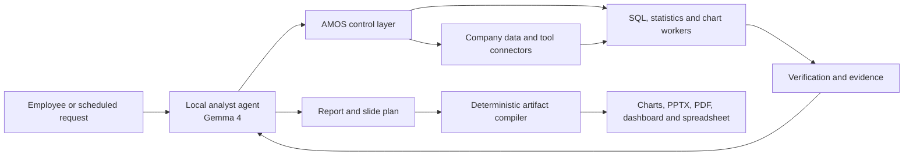

# AMOS Product Requirements

Status: **canonical product direction**

Last updated: 2026-07-25

## Product definition

> AMOS is an internally deployed analyst system that connects to company data
> and tools, answers business questions, performs verified analysis, and
> produces graphs, reports, and presentation slides.

AMOS is sold as a complete product. A customer should not need to supply a
separate AI agent. AMOS includes an analyst agent, a control layer, data and
tool connectors, deterministic analytical workers, verification, evidence,
review, and artifact generation.

The product is domain-neutral. Payment analysis is not part of the product
definition. Any payment-specific code or data in the current repository is a
temporary reference fixture that must be replaced by configurable task,
metric, policy, connector, verifier, and artifact definitions.

## Long-term product goal

The long-term goal is to replace the end-to-end work performed by data analysts
and business analysts for supported workflows. AMOS must do more than help a
human write SQL: it must accept the business question, perform the analysis,
explain the result, produce the graphs and presentation, answer follow-up
questions, and keep the work current.

This is an engineering and commercial goal, not a claim about the current
repository. Replacement is proven workflow by workflow through accuracy,
coverage, review burden, reliability, cost, and customer adoption.

## Required product flow

This flow is normative. The model proposes analytical work and explanations.
AMOS authorizes, limits, executes, verifies, records, and publishes that work.
The model never receives unrestricted credentials and cannot bypass AMOS to
reach company systems.

## Primary user outcome

A user asks a business question or schedules a recurring analysis. AMOS returns
a decision-ready package containing:

- a direct answer and executive summary;
- verified findings and stated limitations;
- tables and graphs;
- a PowerPoint presentation;
- a PDF or HTML report;
- a spreadsheet or machine-readable result where requested;
- the queries, calculations, metric definitions, and data versions used;
- claim-level citations and freshness information;
- assumptions, unresolved questions, and required review decisions; and
- a replayable record that can be revalidated when a source changes.

The product succeeds when a company can complete recurring data-analyst and
business-analyst work with materially less manual effort while maintaining
clear permissions, reproducible calculations, and review for high-impact
judgment.

## Product boundary

AMOS has three inseparable parts:

1. **Analyst agent.** A locally deployed or customer-approved language model
   understands the request, proposes a plan, drafts queries and tool calls,
   interprets verified results, and plans the report and slides.
2. **Control and analysis runtime.** AMOS compiles permitted context, checks
   policies and plans, issues narrow capabilities, runs approved tools,
   verifies results, records evidence, and manages review, replay, and
   invalidation.
3. **Artifact compiler.** Deterministic renderers turn verified result objects
   and an approved narrative plan into charts, PPTX, PDF, HTML dashboards, and
   spreadsheets.

AMOS does not replace the customer's warehouse, identity provider, catalog,
semantic layer, or source applications. It connects to those systems and
applies their permissions and definitions to each analytical task.

## Local model requirements

Gemma 4 is the first supported local model family, not a permanent dependency
of the AMOS contracts.

The model subsystem must:

- expose a provider-neutral `ModelProvider` interface;
- support Gemma 4 through a customer-local inference service;
- support structured plan, tool-call, narrative, and slide-plan outputs;
- record provider, model, quantization, prompt-template version, input-manifest
  hash, output hash, latency, token counts, and generation settings;
- allow a customer to substitute another approved local or hosted model;
- send only permission-filtered, purpose-limited context to the model;
- prevent model output from directly becoming an authoritative number;
- fail closed when structured output is invalid or the model is unavailable;
- run without outbound model or telemetry traffic in private deployments; and
- make model weights an installable component with all required license and
  notice files.

The initial deployment target should support:

- Gemma 4 26B A4B Q4 for the standard server profile;
- Gemma 4 12B Q4 for a lower-resource profile; and
- Gemma 4 E4B Q4 for development, routing, or constrained tasks.

Model quality must be measured on real analytical tasks. A smaller model is not
accepted merely because it runs on less hardware.

## Data and tool connector requirements

Every connector must implement discovery, observation, bounded reads,
revalidation, change events, and health reporting. Production support requires
real-service conformance tests for credentials, permission mapping, schema
changes, freshness, pagination, quotas, retries, outages, and revocation.

The planned connector order is driven by customer demand. Candidate systems
include:

- Snowflake, Databricks SQL, BigQuery, Redshift, and PostgreSQL;
- dbt and customer semantic or metric definitions;
- catalogs and lineage systems;
- spreadsheets and approved business documents;
- CRM, finance, support, product-analytics, and operational applications; and
- approved publication destinations.

Connectors are read-only by default. Any write action requires a separate
policy, approval, idempotency, rollback, and audit contract.

## Analytical execution requirements

The model may propose work, but deterministic workers perform authoritative
computation.

AMOS must:

- parse and validate every query before execution;
- apply user, tenant, source, relation, column, purpose, and sensitivity rules;
- use current approved schemas, metrics, filters, and effective dates;
- enforce time, row, byte, concurrency, and cost limits;
- execute statistics through versioned functions with recorded parameters;
- bind every graph to its verified data result;
- recompute all reported numbers independently from model-written prose;
- label partial, stale, ambiguous, or insufficient results;
- require review for causal, regulated, external, or high-impact conclusions;
- preserve the exact source and execution versions used; and
- invalidate or replay dependent work when relevant inputs change.

## Artifact requirements

The artifact compiler must consume verified result objects rather than raw
model prose.

Each output must support:

- a consistent company template and theme;
- charts bound to verified data and carrying accessible labels;
- editable PPTX slides with titles, graphs, tables, conclusions, citations, and
  speaker notes;
- PDF and HTML report rendering;
- spreadsheet export with values, units, filters, and source references;
- claim-level links back to evidence;
- sensitivity labels and intended audience;
- deterministic hashes and versioned templates; and
- regeneration without rerunning unchanged computations.

The model may choose the story and propose chart types. Deterministic code
renders the final files and rejects narrative claims that lack verified
support.

## Core user workflows

The first product release must support:

1. an employee asks an ad hoc business question;
2. a user schedules a recurring report or presentation;
3. AMOS discovers the relevant approved sources and definitions;
4. the local agent proposes a typed plan;
5. AMOS verifies and executes the plan;
6. the agent interprets only the verified results;
7. AMOS verifies each material claim;
8. the artifact compiler produces graphs, a report, and slides;
9. a reviewer resolves required review items;
10. AMOS publishes or exports the approved package; and
11. later source changes trigger revalidation, invalidation, or replay.

Follow-up questions must reuse the prior task's permitted context and evidence
without silently changing the metric, population, time range, or source
version.

## Administration and deployment requirements

AMOS must be deployable inside the customer's controlled environment as a
single supported software purchase. Supported packaging should include a
container or virtual-machine appliance first and a Kubernetes deployment when
needed.

Administrators must be able to configure:

- identity and group mapping;
- sources, credentials, and network rules;
- model and inference hardware;
- metric, schema, policy, and artifact definitions;
- tool and resource limits;
- review and publication rules;
- retention, legal hold, and erasure;
- schedules and notification destinations; and
- audit, health, usage, and performance reporting.

No company data may leave the deployment unless an administrator explicitly
configures and authorizes that destination.

## Success measures

Product evaluation must report:

- percentage of representative analyst tasks completed correctly;
- material-number accuracy;
- unsupported-claim rate;
- permission and sensitive-data violations;
- SQL, schema, metric, and freshness error detection;
- chart-to-data and slide-to-evidence correctness;
- time from question to completed artifact;
- human review minutes per artifact;
- recurring reports completed without manual repair;
- replay success after source changes;
- customer deployment and onboarding time; and
- analyst hours replaced or avoided per month.

The product must not claim that it replaces a data analyst or business analyst
until customer evidence shows that it completes the relevant work at the
required accuracy, review burden, reliability, and cost.

## Current repository status

The Rust repository already implements much of the control and analysis
runtime: governed memory, permission-first context, typed plans, bounded SQL,
statistics and chart workers, evidence, review, invalidation, replay,
publication, API, CLI, and four local product surfaces.

The repository does not yet implement the complete product defined here. The
largest gaps are:

- no bundled or integrated Gemma 4 analyst agent;
- payment-specific task, schema, metric, policy, verifier, UI, and demo code;
- no configuration-driven domain packs;
- no production customer connectors;
- no general report and slide planner;
- no deterministic PPTX, PDF, or spreadsheet compiler;
- no enterprise identity, secret custody, isolated workers, or supported
  customer deployment package; and
- no customer evidence that the system replaces analyst work.

These gaps are product requirements, not completed features.
